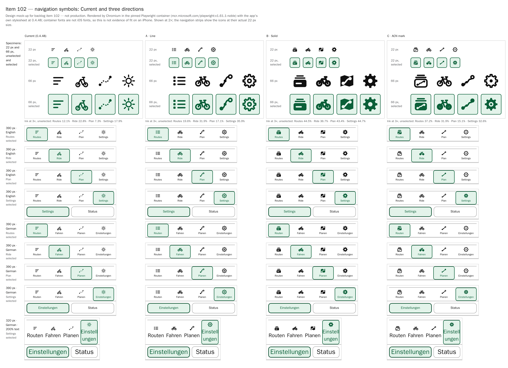

# Item 102 — primary-navigation symbol mock-ups

**Status: design stage, awaiting the rider's choice.** This directory holds the mock-ups and measurements for backlog [item 102](../../project/backlog.md#item-102), prepared on 30 September 2026 against app version `0.4.48` (parent commit `d904e99`). No production icon, source file or app version has changed, and item 102 is **not** implemented. Nothing here approves or schedules item 28 (adaptive compact navigation), and nothing here restructures the navigation: the destinations, labels, order, touch targets, accessible names and behaviour are exactly as in `0.4.48`. Item 103's wider visual audit should take whichever direction is chosen into account; it does not depend on it.

These are design references, not screenshots of implemented behaviour, and they are not device evidence (see [Limitations](#limitations)).

## Images

- [`images/comparison.png`](images/comparison.png) — the compact side-by-side view: Current and the three directions as columns; specimens at 22 px and 66 px, unselected and selected; the navigation at 390 px in English **and** German with each destination selected (the icons at their actual 22 px size); and one 320 px German 200%-text strip.
- [`images/direction-a.png`](images/direction-a.png), [`images/direction-b.png`](images/direction-b.png), [`images/direction-c.png`](images/direction-c.png) — one full matrix per direction: 390 px and 320 px, English and German, light and dark, 200% root text, two greyscale rows, and a keyboard-focus cell, each with every destination selected in turn plus the Status view of Settings.
- [`images/context.png`](images/context.png) — the sticky-header context: a 390 × 844 viewport with a 47 px simulated top safe-area inset, scrolled so content passes beneath the header (and, on Settings, beneath the stuck Settings/Status switcher), in light and dark.



## The directions

All three are project-owned vectors drawn for this item on the same 24-unit grid, in the same 22 px box, with `currentColor`, exactly as `src/ui/shared/NavIcon.tsx` renders today. Three rules hold throughout:

- **Plan owns the route motif.** It borrows the logo's curve and Planning's own markers: a filled start disc and a ringed finish (`.planning-waypoint-marker--start`/`--finish`).
- **Routes is a collection symbol** with no route dots, rings or curve (except in C, where that is the direction's deliberate trade — see below).
- **Settings is always a gear**, the platform-neutral settings symbol, replacing today's ticked circle, which reads as a sun. Every gear keeps separate teeth at 1× (checked on a 4× nearest-neighbour enlargement of a 1× Chromium render of the final artwork).

| Direction                      | Style                                                                               | Routes                                                 | Ride                              | Plan                                                       | Settings                        | Selected state                                                                                         |
| ------------------------------ | ----------------------------------------------------------------------------------- | ------------------------------------------------------ | --------------------------------- | ---------------------------------------------------------- | ------------------------------- | ------------------------------------------------------------------------------------------------------ |
| **A · Line** (refines today's) | one uniform 2 px painted outline, round caps and joins (the crosshair's convention) | bulleted list — square bullets, so not a hamburger     | bicycle, redrawn with fewer tubes | route leg: filled start disc, waypoint disc, ringed finish | 8-tooth outline gear with a hub | same glyph in both states                                                                              |
| **B · Solid**                  | filled silhouettes with knocked-out detail                                          | a stack of cards                                       | heavier bicycle (2.6 px)          | folded map with a knocked-out route                        | solid gear with a hole          | same glyph in both states                                                                              |
| **C · ACN mark**               | the logo's elements: its curve, its round dots, its rounded card                    | a stack of route cards, the front one bearing the mark | bicycle                           | the mark itself, with a waypoint on it                     | outline gear with a dot hub     | **outline when unselected, filled when selected** — solid card, disc wheels, solid gear, filled finish |

### Comparison

| Criterion                 | A · Line                                                                                                                                                                  | B · Solid                                                                                                                                                                                                                                                     | C · ACN mark                                                                                                                                                                 |
| ------------------------- | ------------------------------------------------------------------------------------------------------------------------------------------------------------------------- | ------------------------------------------------------------------------------------------------------------------------------------------------------------------------------------------------------------------------------------------------------------- | ---------------------------------------------------------------------------------------------------------------------------------------------------------------------------- |
| Recognisability           | Highest. List, bicycle, route with waypoints and gear are all conventional pictograms; the gear is unmistakable where Current's sun is not.                               | High for the gear and the map; the bicycle is clear but dense; the card stack is the least immediate.                                                                                                                                                         | Gear and bicycle clear; Plan reads as a route; Routes, a card stack bearing the logo curve, is the least conventional of all nine new glyphs.                                |
| Routes versus Plan        | Strongest separation: a list with no route motif against a route leg with Planning's own markers.                                                                         | Clear: a stack of cards against a map.                                                                                                                                                                                                                        | Weakest: both carry the logo curve and are told apart only by the card stack.                                                                                                |
| Ambiguity                 | The list could be read as a generic list or menu; the label resolves it.                                                                                                  | The card stack can read as a box, tray or archive; the map could be read as "maps" rather than "plan", although planning in ACN does happen on a map.                                                                                                         | The card stack can read as a box or a photo stack; the mark alone could be read as a generic "route" or "connection".                                                        |
| Stroke and fill           | Consistent: one 2 px line throughout, with small solid details only (bullets, discs).                                                                                     | Consistent solids, except the bicycle, which has no solid mass and is drawn as heavy 2.6 px strokes.                                                                                                                                                          | 2 px line when unselected, solid when selected. Plan changes least on selection (only its finish fills), so its shape cue is the weakest of the four.                        |
| Visual weight (ink below) | Light to medium; the gear is the heaviest by area and Plan the lightest, though Plan spans the full diagonal and does not look faint at 22 px.                            | Heaviest and most even; the icons compete more with their labels than in A or C.                                                                                                                                                                              | Medium, heavier when selected; Plan is clearly the lightest.                                                                                                                 |
| Fit with ACN              | Continues the drawn line language of the map controls (crosshair 2 px, zoom 2.5 px) and Planning's markers; the logo's curve reappears in Plan.                           | Bolder than the app's other drawn controls, which are mostly line-based (the north-up arrow is the filled exception). The navigation is hidden during an active ride (the immersive shell), so glance contrast matters less here than on the riding controls. | The strongest brand tie: the logo's curve, dots and rounded card.                                                                                                            |
| Platform neutrality       | Project-owned, no system glyph or font; conventional on both iOS and Android.                                                                                             | As A.                                                                                                                                                                                                                                                         | As A; the brand motif is ACN's own.                                                                                                                                          |
| Implementation cost       | Lowest: replace the four glyph functions in `NavIcon.tsx`; no API change. No existing test pins glyph shapes (`MainNavigation.test.tsx` asserts four `aria-hidden` SVGs). | As A; the knock-outs are `evenodd` compound paths, so no masks or ids.                                                                                                                                                                                        | Highest: two glyphs per destination and a `selected` prop threaded from `MainNavigation` into `NavIcon` (which already computes `aria-current`), with tests for both states. |

**Recommendation: A · Line.** It separates Routes from Plan most clearly, makes Settings immediately recognisable, speaks the same line language as the app's other drawn controls, keeps the existing selected treatment (whose inset ring already carries the non-colour cue — see below), and is the smallest and safest production change. C's fill-on-selection is a genuine extra shape cue, and could be added to A later if wanted, but the non-colour requirement does not need it. **This is a recommendation only; the choice is yours** — A, B or C as drawn, a combination, or none.

### Rejected metaphors

| Symbol                    | Reason                                                                                      |
| ------------------------- | ------------------------------------------------------------------------------------------- |
| Teardrop map pin          | Reads as "a place" rather than a waypoint, and collides with the Routes library's push-pin. |
| Pencil                    | Reads as "edit", which clashes with route and tag editing.                                  |
| Folder                    | A generic file store, and too detailed at 22 px.                                            |
| Sliders for Settings      | Commonly means "filter", beside the Routes library's tag filters.                           |
| Navigation arrow for Ride | Collides with the map's north-up dart.                                                      |
| Folded map for Routes     | Competes with Plan.                                                                         |
| Bookmark                  | Collides with route pinning.                                                                |

Three drafts were also discarded after rendering: a full diamond-frame bicycle, which merged into a blob at 22 px; short back-card edges, which read as a jar lid; and a back card drawn as a rounded top edge, which read as a bag handle.

## Measurements

`capture.mjs` measured every direction, including Current, in **Chromium and WebKit** in the pinned container, at every condition in the matrices, with every destination selected and the Status view, both unstressed and under item 113's 1.12 label-width stress (the `applyNavWidthStress` technique from `e2e/language.spec.ts`).

- **Navigation geometry is identical to Current**: the largest difference in any tab, label or icon rectangle, in either engine, under any condition, is **0.00 px**. Label fit is therefore a property of the unchanged labels and stylesheet, not of any direction.
- **Header and switcher**: no overflow anywhere; no label or icon outside its button anywhere.
- **Touch targets**: no tab is narrower than 55.1 px (320 px, English, 200%, stressed; 63.3 px unstressed) or lower than 57 px, and no switcher button is lower than 44 px (48 px at 200%) — all above the 44 px floor. Chromium and WebKit agree to within 0.1 px.
- **Page overflow of 13 px** at 320 px with 200% text comes from the mock-up's _placeholder_ Settings content — its copy of the `OpenRouteService` card heading at 37.44 px — not from the navigation, and it is identical for Current. It was not measured against the production Settings screen in this slice.
- **German wrapping** (`Einstellungen` onto two lines, three when stressed at 320 px and 200%) is identical for every direction and Current, and is the containment item 113 accepted.

| Condition                      | Page overflow | Header and switcher overflow | Outside button | Label lines (1 / 1.12) | Narrowest tab (1 / 1.12) | Lowest switcher button |
| ------------------------------ | ------------- | ---------------------------- | -------------- | ---------------------- | ------------------------ | ---------------------- |
| 390 px · English (light, dark) | 0             | 0                            | 0              | 1 / 1                  | 90.5 × 57 / 90.5 × 57    | 44                     |
| 390 px · German                | 0             | 0                            | 0              | 1 / 1                  | 90.5 × 57 / 90.5 × 57    | 44                     |
| 320 px · English               | 0             | 0                            | 0              | 1 / 1                  | 73 × 57 / 73 × 57        | 44                     |
| 320 px · German (light, dark)  | 0             | 0                            | 0              | 1 / 2                  | 73 × 57 / 73 × 72        | 44                     |
| 390 px · English · 200%        | 0             | 0                            | 0              | 1 / 1                  | 90.5 × 73 / 87.9 × 73    | 48                     |
| 390 px · German · 200%         | 0             | 0                            | 0              | 2 / 2                  | 90.5 × 104 / 90.5 × 104  | 48                     |
| 320 px · English · 200%        | 13            | 0                            | 0              | 1 / 1                  | 63.3 × 73 / 55.1 × 73    | 48                     |
| 320 px · German · 200%         | 13            | 0                            | 0              | 2 / 3                  | 73 × 104 / 73 × 135      | 48                     |

**Optical weight.** Ink coverage of the 24-unit box, drawn by Chromium from each icon's standalone SVG at 3 px per unit (66 px, the iPhone's 3×). The same renders confirm that no icon's ink leaves its box. Coverage is an area proxy, not a perceptual measure: an open glyph such as a route leg covers little area while spanning the whole box.

| Direction        | State      | Routes | Ride  | Plan  | Settings | Max / min |
| ---------------- | ---------- | ------ | ----- | ----- | -------- | --------- |
| Current (0.4.48) | both       | 12.1%  | 22.8% | 7.3%  | 17.9%    | 3.12      |
| A · Line         | both       | 19.6%  | 31.9% | 17.1% | 35.9%    | 2.10      |
| B · Solid        | both       | 44.5%  | 36.7% | 43.4% | 44.7%    | 1.22      |
| C · ACN mark     | unselected | 37.2%  | 31.9% | 15.1% | 32.6%    | 2.46      |
| C · ACN mark     | selected   | 42.2%  | 36.8% | 15.2% | 34.2%    | 2.78      |

**Selected state without colour.** The selected tab keeps the app's own treatment: a soft accent surface plus a 2 px inset ring. The surface alone barely differs from the page (1.15:1 light, 1.45:1 dark); the **ring** is what carries the state, at 7.76:1 against the page in light and 11.24:1 in dark, and the greyscale rows in every matrix show it survives with colour removed. The icon colours meet WCAG 1.4.11's 3:1 in every state: unselected 19.03:1 (light) and 17.83:1 (dark); selected, on the soft surface, 6.75:1 and 7.74:1. C adds a change of shape on top of this. Keyboard focus keeps the global `button:focus-visible` outline (the focus cell in each matrix).

**Image sizes.** `comparison.png` 668,427 bytes; `direction-a.png` 352,833; `direction-b.png` 344,386; `direction-c.png` 349,939; `context.png` 230,539 — about 1.95 MB in all. Rendering is deterministic: re-running the capture after formatting the sources produced byte-identical images.

## Provenance and licence

All artwork here is project-owned and was drawn for this item; **no external icon family, icon font or third-party asset is used**, so no third-party licence applies. Gears, bicycles, lists, maps and card stacks are generic pictographic conventions, not copied artwork. The Current column is transcribed from `src/ui/shared/NavIcon.tsx` at `0.4.48`. The gear outlines and the knocked-out route outlines were computed numerically once and pasted in as literal path data; the construction is described in a comment above the artwork in `mockup.html`. No licence is claimed for anything in this repository.

## Limitations

- **Container rendering does not prove fit on iOS.** In the pinned container, `system-ui` resolves to a Linux fallback font (WenQuanYi Zen Hei), not the iPhone's system font; item 113 showed these widths do not predict iOS (`Einstellungen` wrapped on the iPhone where the container kept it on one line). The labels are unchanged from production, so their fit is production's own, not something this slice alters.
- WebKit here is desktop WebKit on Linux, not iOS Safari: no installed Home Screen PWA, no touch, no suspension. 200% browser root text is the project's enlarged-text proxy, **not** iOS Dynamic Type. No VoiceOver, physical iPhone or physical Android claim is made.
- 320 px is a stress floor, narrower than any supported iPhone.
- The safe area is simulated through the project's own `--safe-area-inset-top` custom property; the black pill in `context.png` is a drawing of a status bar. Screen content beneath the navigation is placeholder.
- Accessible names are unchanged: the icons stay `aria-hidden`, and the visible labels carry the meaning.
- `mockup.html` links the **live** `src/index.css`, so it will drift as the stylesheet changes; the PNGs record the `0.4.48` rendering.

## Viewing and regenerating

GitHub does not render HTML, so open [`mockup.html`](mockup.html) in a browser from a local checkout (it loads the stylesheet from disk; any static server at the repository root works too). With no query string it shows an index of every direction; `?dir=a&selected=planning&lang=de&text=200` shows one navigation state, and the full parameter list is at the top of the file. The artwork is the `DIRECTIONS` object between the `ICONS:BEGIN` and `ICONS:END` markers.

To regenerate the images and the measurements (about a minute and a half), from the repository root:

```sh
docker run --rm --user "$(id -u):$(id -g)" -e HOME=/tmp \
  -v "$PWD":/work -v /tmp/item102:/scratch -w /work --ipc=host \
  mcr.microsoft.com/playwright:v1.61.1-noble \
  node docs/design/navigation-symbols/capture.mjs /scratch
```

`capture.mjs` writes only `images/` here and, in the scratch directory, the intermediate cell images, `measurements.json` and `report.md` (the tables above). It is design tooling: nothing in the app imports it, and it is neither linted nor type-checked.

## Next step

Once a direction is chosen, production implementation is a separate, bounded slice: the chosen glyphs in `NavIcon.tsx`, focused tests, measurements in the pinned container, and acceptance on the installed iPhone. None of that has started.
