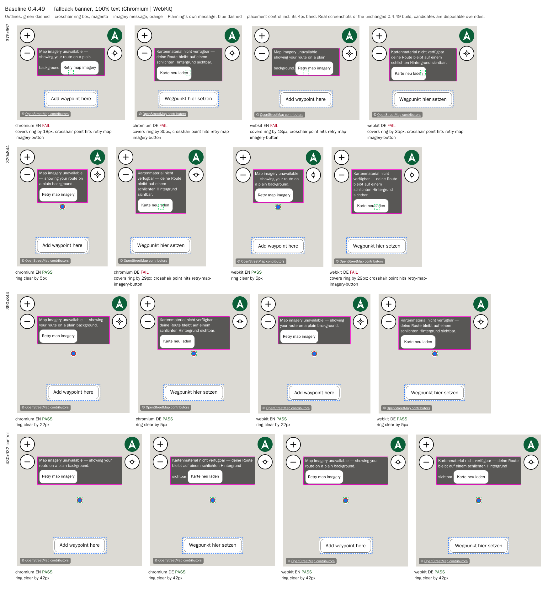
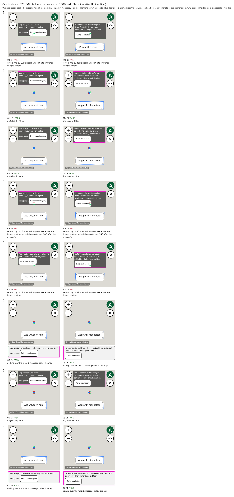
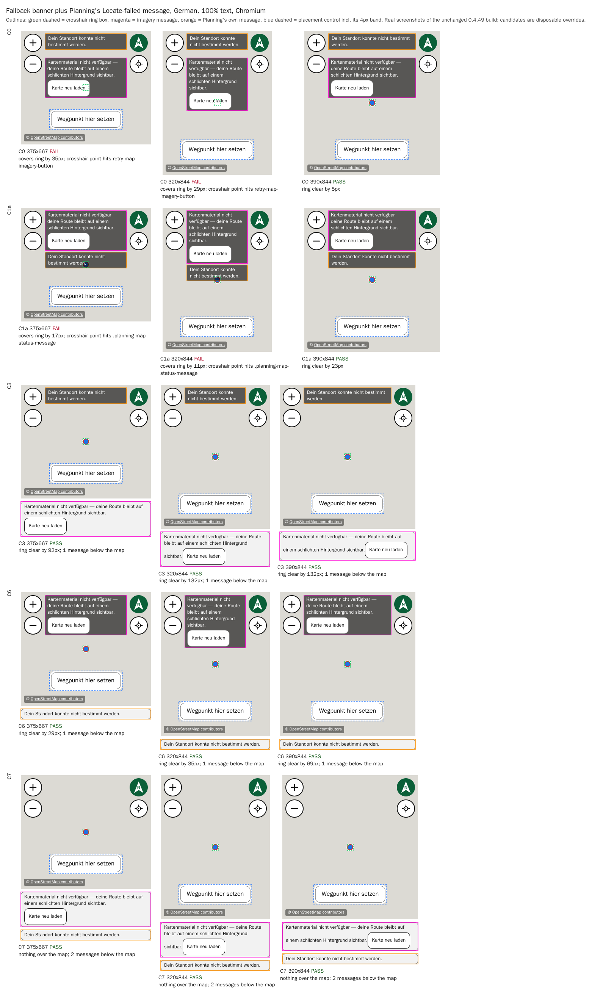
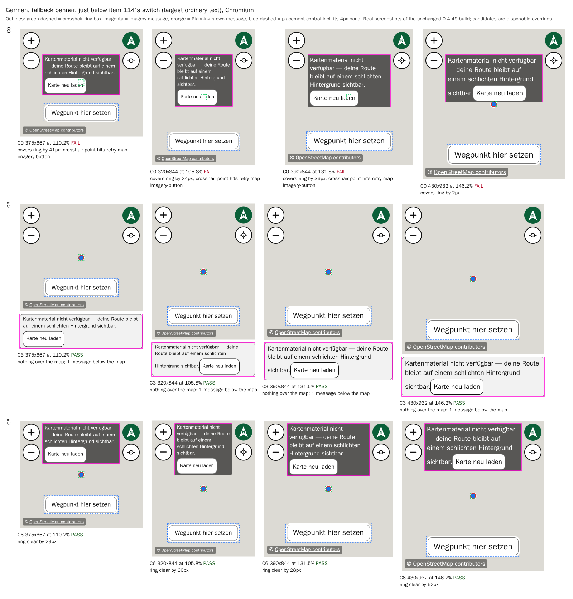
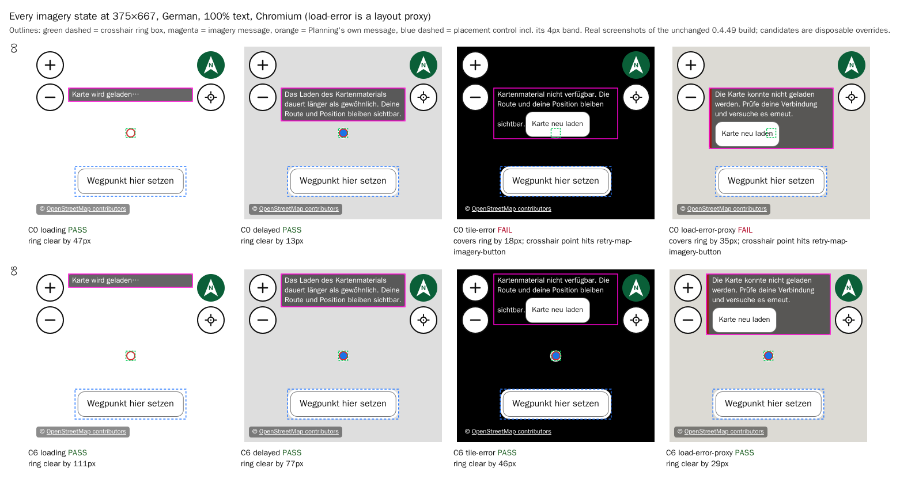
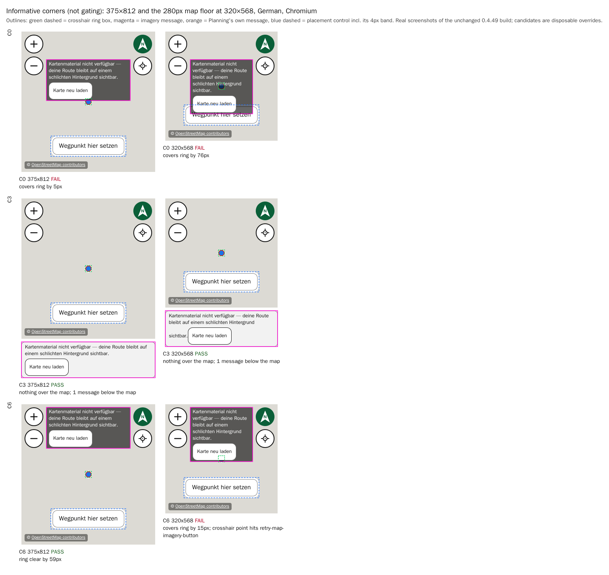
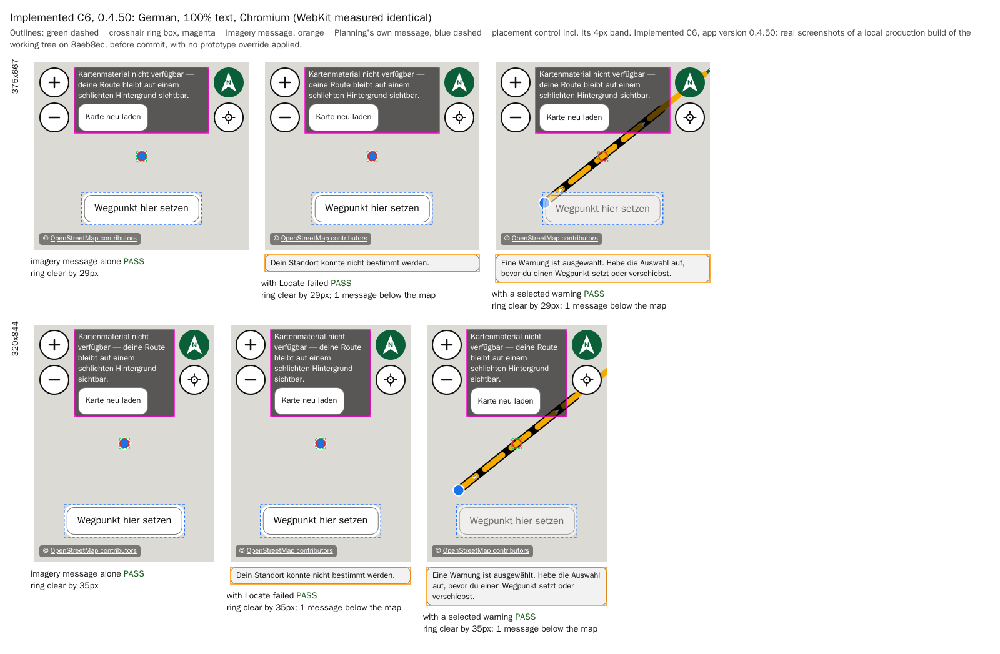

# Item 128 — Planning's imagery banner and the placement crosshair

**Status (1 October 2026): C6 chosen and implemented in `0.4.50`.** The rider chose C6 on 1 October 2026, and it shipped in `0.4.50`. The implementation record is [item 128's history entry](../../project/history/items-118-NN.md#item-128), and its installed-iPhone check is pending in [`current-status.md`](../../project/current-status.md). The implemented layout is shown in [Implemented in `0.4.50`](#implemented-in-0450) at the end of this document. Everything else here is the design-stage record as written on 30 September 2026, kept unchanged apart from annotations marking the decisions it asked for. The 320×568 German overlap of 15 px it reported remains, and is not hidden.

**Design-stage summary (30 September 2026).** _At that stage no correction was chosen and nothing was implemented._ This directory holds the measured comparison for [item 128](../../project/history/items-118-NN.md#item-128). It was prepared on 30 September 2026 against app version `0.4.49` at commit `1dd8c1a`. No application source, test, stylesheet or version changed. Every candidate below is a disposable browser override applied to the unchanged production build, and each was restored after it was measured.

**Recommendation: C6.**

- **What changes:** Planning's imagery message stays inside the map, moves to the top slot at 8px, and becomes the only message in the map. Planning's own three messages (Locate failed, clear the selected warning, clear the selected feature) move below the map at ordinary text. That is where item 114 already puts them at enlarged text.
- **What it passes:** every required and control case, in Chromium and WebKit, in English and German, in every imagery state, at 100% text and just below item 114's switch, with Planning's own messages showing and without.
- **What it keeps:** item 108's decision.
- **Decision needed:** whether the rider approves moving Planning's own messages below the map at ordinary text. _Decided on 1 October 2026: approved._
- **Alternative:** if the messages should stay in the map, the only passing candidate is **C3**. C3 moves the imagery message below the map instead, which revises item 108 for Planning at ordinary text. See [Recommendation](#recommendation).

These are automated browser measurements in the pinned Playwright container, never installed-iPhone evidence (see [Limitations](#limitations)).

## Contents

- [What was tested](#what-was-tested)
- [Three kinds of evidence](#three-kinds-of-evidence)
- [Baseline: the reproduction](#baseline-the-reproduction)
- [Findings beyond the recorded overlap](#findings-beyond-the-recorded-overlap)
- [The 72px offset: origin and relevance](#the-72px-offset-origin-and-relevance)
- [Candidates](#candidates)
- [Results](#results)
- [Recommendation](#recommendation)
- [Provisional implementation scope and regression checks](#provisional-implementation-scope-and-regression-checks)
- [Limitations](#limitations)
- [Reproducing](#reproducing)

## What was tested

|                     |                                                                                                                                                                                                                                    |
| ------------------- | ---------------------------------------------------------------------------------------------------------------------------------------------------------------------------------------------------------------------------------- |
| Commit              | `1dd8c1a` (`main`), app version `0.4.49`, built with `npm run build`                                                                                                                                                               |
| Container           | `mcr.microsoft.com/playwright:v1.61.1-noble@sha256:5b8f294aff9041b7191c34a4bab3ac270157a28774d4b0660e9743297b697e48`, the digest the E2E workflow pins; the local image's RepoDigest was checked against it                        |
| Browsers            | Chromium 149.0.7827.55 (Playwright's Desktop Chrome) and WebKit 26.5 (Desktop Safari), with the viewport overridden, `deviceScaleFactor` 2, `serviceWorkers: "block"`                                                              |
| Node                | 24.17.0 in the container; the build ran on the host's Node 24.13.0 and npm 11.16.0 (`.nvmrc` pins 24.18.0, and CI is authoritative)                                                                                                |
| Fonts               | the container's resolution of the app's `system-ui, -apple-system, "Segoe UI", Roboto, sans-serif` stack, **not** iOS SF                                                                                                           |
| Imagery             | the E2E suite's own local fixtures, imported unmodified from `e2e/support/localMapStyle.ts`, so there are no live tiles; there is no personal key, and the warning case uses the suite's `dummy-e2e-key` against a mocked provider |
| Copy                | read from the app's own catalogues (`src/i18n/messages.{en,de}.ts`)                                                                                                                                                                |
| Required sizes      | 375×667, 320×844 and 390×844, with 430×932 as the larger control                                                                                                                                                                   |
| Informative corners | 375×812 (iPhone mini) and 320×568 (the map's 280px height floor); not gating                                                                                                                                                       |

**The probe's method.** Every case opens Planning from a fresh page in one imagery state and waits for **that state's own settling condition**:

| State      | Settled when                                                                                                        |
| ---------- | ------------------------------------------------------------------------------------------------------------------- |
| fallback   | `data-map-ready="true"` and the banner is visible                                                                   |
| tile-error | ready, then a proven failed tile request (the suite's `triggerFreshTileFailure` method), then the banner is visible |
| delayed    | tiles are held, a held request is counted, `data-map-ready` stays `"false"` and the banner is visible               |
| loading    | a 12s style delay, `data-map-ready="false"` and "Loading map…" is visible                                           |

Every measurement is then taken twice, 300ms apart. It must give identical geometry, the same test id and text, and nodes that are all still connected, or it is retried, at most three times, and then fails. None failed.

Each case records:

- **Boxes, relative to the map,** with signed separations: the imagery message and its Retry, the crosshair ring, the placement control including its 4px band, the attribution, both control clusters, Planning's own messages, and the document's horizontal overflow.
- **Stacking**, by walking the ancestry for stacking contexts.
- **Paint order over the ring.** Every painter is made hit-testable through the CSSOM for one query, then restored and read back.
- **Pointer pass-through**, kept separate from paint order: what a real tap reaches at the crosshair point, over the imagery text and on Retry.
- **Arrival visibility**, at the page's own top before any scrolling.

**Criteria, all absolute:**

- **The ring:** the ring's box is clear of every message inside the map, with separation above zero.
- **Taps:**
  - taps at the crosshair point and over the imagery text reach the map;
  - Retry is on top, hittable, and at least 44×112.
- **Other elements:** messages are clear of the control, the attribution, the clusters and each other.
- **Visibility:** every message is fully visible with the map in view.
- **Stability:** there is no horizontal overflow, and the map's box and canvas node are unchanged.

## Three kinds of evidence

Every figure here is one of three kinds:

- **Recorded.** Item 114 Stage 1's earlier measurements, whose probes were never committed.
- **Source-reasoned.** Inferences from the CSS and JSX, labelled as such.
- **Measured.** New results from [`capture.mjs`](capture.mjs). Only these count as this stage's findings.

## Baseline: the reproduction

**Measured**, fallback banner, 100% text, Add label:

| Size    | Map     | Ring (from the map's top) | English: banner ends / result | German: banner ends / result | Recorded (item 114 Stage 1)           |
| ------- | ------- | ------------------------- | ----------------------------- | ---------------------------- | ------------------------------------- |
| 375×667 | 343×300 | 142–158                   | 160 / **overlap 18px**        | 177 / **overlap 35px**       | English 160, German 177: both overlap |
| 320×844 | 288×380 | 182–198                   | 177 / clear by 5px            | 211 / **overlap 29px**       | English 177 clear; German 211 overlap |
| 390×844 | 358×380 | 182–198                   | 160 / clear by 22px           | 177 / clear by 5px           | clear                                 |
| 430×932 | 398×420 | 202–218                   | 160 / clear by 42px           | 160 / clear by 42px          | clear                                 |

- **Engines.** Chromium and WebKit gave identical figures in every case. The recorded overlaps reproduce exactly.
- **Riding.** In Riding's pre-ride overview, the same overlay computes `top: 72px`, measured with the `smoke-route` fixture.



## Findings beyond the recorded overlap

All of these are **measured**, and every one of them is on the unchanged `0.4.49`.

1. **Retry sits on the crosshair point.** In every overlapping case, the crosshair centre hits `retry-map-imagery-button` rather than the map. Visually, the button covers all but a sliver of the ring.
   - For touch, nothing is lost: since item 123, placement goes through the control, whose own position is unaffected.
   - A **mouse click at the crosshair retries imagery instead of placing a waypoint.**
   - Clicking the map at the banner's position was refused outright by Playwright, which reported that Retry intercepts the pointer.
   - Visual obstruction and pointer blocking are separate findings here: the banner's text is correctly click-through everywhere.
2. **The tile-error state overlaps too:** by 18px at 375×667 in both languages, and by 12px at 320×844 in German. The **load-error layout proxy** overlaps by 18px (English) and 35px (German) at 375×667, and 12px at 320×844 in German. The delayed and loading states clear the ring at 100% at every size: they have no Retry, so they are shorter.
3. **The ordinary layout already fails just below item 114's switch at every size.** Just below the switch, text is at its largest while Planning is still in the ordinary layout. There the fallback banner covers the ring:

   | Size    | Root text | English      | German       |
   | ------- | --------- | ------------ | ------------ |
   | 375×667 | 110.2%    | overlap 41px | overlap 41px |
   | 320×844 | 105.8%    | clear by 2px | overlap 34px |
   | 390×844 | 131.5%    | overlap 13px | overlap 36px |
   | 430×932 | 146.2%    | overlap 2px  | overlap 2px  |

   So 390×844 and the 430×932 control are **not** clear across the whole ordinary range, only at 100%.

4. **Planning's own message already collides with the imagery banner.** With a warning selected, Planning's message (top 8px, later in the DOM at the same z-index) covers the banner's text:
   - by 29px at 320×844 in German, at 100%;
   - by 20–59px just below the switch.

   With a warning or feature selected, placement is disabled, but the imagery message is still partly hidden.

5. **375×812 (iPhone mini, informative) also overlaps** in German, by 5px. At the **320×568** floor the banner overlaps the ring by 45px (English) and 76px (German), and in German it also reaches the placement control.

## The 72px offset: origin and relevance

**Recorded and source-reasoned.**

- **Origin.** `top: 72px` dates from item 67, as headroom for Riding's climb cue.
- **Riding.** Item 108 retired that reason: during active riding and free roam the overlay renders nothing.
- **Planning.** Item 108 kept the value only because Planning's own `.planning-map-status-overlay` occupies top 8 / left 64 / right 64 in the same map (`src/index.css`, the rule's own comment).
- **What that means now.** The 72px therefore has one live purpose in Planning: to stop the two overlays sharing a rectangle. It achieves that only partly: finding 4 shows Planning's box, which has no height cap, still reaching down over the banner. It also puts the banner's lower edge, and its Retry, in the band where the ring lives on a small map.
- **Riding's pre-ride overview** also renders this overlay. Nothing there needs 72px either, but item 128 is Planning-only: every candidate below is Planning-scoped, and Riding stays at 72px.

## Candidates

All were prototyped on the unchanged build:

- **CSS candidates** as rules inserted into the app's own stylesheet through the CSSOM, each read back through `getComputedStyle`. The CSP blocks injected `<style>` elements.
- **C1, C3, C6 and C7** also moved the real React-owned overlay node, as item 114 Stage 1 did. Each move was restored before any layout switch or navigation, and every restore was checked to reproduce the baseline geometry exactly.

| #   | Candidate                                                                                                                                                                                                                       | Item 108                                                             | Other decision it changes                              |
| --- | ------------------------------------------------------------------------------------------------------------------------------------------------------------------------------------------------------------------------------- | -------------------------------------------------------------------- | ------------------------------------------------------ |
| C0  | Baseline `0.4.49`                                                                                                                                                                                                               | —                                                                    | —                                                      |
| C1a | One in-map column at the top: the imagery overlay inside Planning's own overlay, imagery first. The column is `pointer-events: none`; Planning's messages keep `auto`; the imagery text stays click-through; Retry stays `auto` | kept                                                                 | —                                                      |
| C1b | As C1a, with Planning's messages first                                                                                                                                                                                          | kept                                                                 | —                                                      |
| C2  | CSS only: Planning-scoped `top: 8px` while Planning shows no message of its own, otherwise 72px                                                                                                                                 | kept                                                                 | —                                                      |
| C3  | The imagery message in flow below the map at ordinary text, reusing item 114's `.planning-map-messages` block; Planning's own messages stay in the map                                                                          | **revised**: the imagery explanation leaves the map at ordinary text | —                                                      |
| C4  | The ring painted above the banner (`z-index: 6`)                                                                                                                                                                                | kept                                                                 | —                                                      |
| C5  | Padding and gap only: message padding 2px 4px, Retry `margin-top` 2px, type size and the 44×112 target unchanged                                                                                                                | kept                                                                 | —                                                      |
| C6  | The imagery message stays in the map, at `top: 8px`; Planning's own three messages move below the map, into the block item 114 already uses for them at enlarged text                                                           | **kept**                                                             | Planning's own messages leave the map at ordinary text |
| C7  | Every map message below the map, imagery first: item 114's enlarged message block at every text size                                                                                                                            | **revised**                                                          | Planning's own messages too                            |

**Not prototyped, with how they were assessed:**

- **`max-height` with scrolling** — source-reasoned only. It would hide text behind a scroll inside a `pointer-events: none` overlay, failing "fully readable".
- **Widening the banner between the clusters** — source-reasoned only. The 64px insets are exactly the clusters' 8 + 48 + 8px, so it cannot widen at the top.
- **The lower band between the ring and the control** — measured. At 375×667 it is 50px (ring bottom 158 to the control's band at 208), smaller than any message with Retry (88–105px).
- **Text and Retry on one row** — not assessed. Item 108 recorded that the equivalent arrangement for the climb cue was impossible at phone width without smaller type.

## Results

**Legend:**

- **The cells:**
  - ✓ or ✗ is the verdict against every criterion above.
  - The number is the ring's separation from the nearest message inside the map, in px: + clear, − overlap, 0 touching.
  - "—" means nothing is inside the map to measure.
- **Superscripts:**
  - <sup>R</sup>: the crosshair point hits Retry or a message rather than the map.
  - <sup>M</sup><i>n</i>: two messages overlap by _n_ px.
  - <sup>C</sup>: a message reaches the placement control.
- **Where the figures come from:** Chromium is shown, and **WebKit was identical in every cell of every table.**

### Fallback banner alone, 100% text (16 cases)

| Size       | C0                | C1a    | C1b    | C2     | C4                | C5                | C3  | C6     | C7  |
| ---------- | ----------------- | ------ | ------ | ------ | ----------------- | ----------------- | --- | ------ | --- |
| 375×667 EN | ✗ −18<sup>R</sup> | ✓ +46  | ✓ +46  | ✓ +46  | ✗ −18<sup>R</sup> | ✗ −14<sup>R</sup> | ✓ — | ✓ +46  | ✓ — |
| 375×667 DE | ✗ −35<sup>R</sup> | ✓ +29  | ✓ +29  | ✓ +29  | ✗ −35<sup>R</sup> | ✗ −31<sup>R</sup> | ✓ — | ✓ +29  | ✓ — |
| 320×844 EN | ✓ +5              | ✓ +69  | ✓ +69  | ✓ +69  | ✓ +5              | ✓ +9              | ✓ — | ✓ +69  | ✓ — |
| 320×844 DE | ✗ −29<sup>R</sup> | ✓ +35  | ✓ +35  | ✓ +35  | ✗ −29<sup>R</sup> | ✗ −8              | ✓ — | ✓ +35  | ✓ — |
| 390×844 EN | ✓ +22             | ✓ +86  | ✓ +86  | ✓ +86  | ✓ +22             | ✓ +26             | ✓ — | ✓ +86  | ✓ — |
| 390×844 DE | ✓ +5              | ✓ +69  | ✓ +69  | ✓ +69  | ✓ +5              | ✓ +9              | ✓ — | ✓ +69  | ✓ — |
| 430×932 EN | ✓ +42             | ✓ +106 | ✓ +106 | ✓ +106 | ✓ +42             | ✓ +46             | ✓ — | ✓ +106 | ✓ — |
| 430×932 DE | ✓ +42             | ✓ +106 | ✓ +106 | ✓ +106 | ✓ +42             | ✓ +46             | ✓ — | ✓ +106 | ✓ — |

- **C4** makes the ring paint on top at every sample point, but the raised ring then covers 240–256px² of the Retry button. The crosshair point still hits Retry.
- **C5** gains only 4px.



[Candidates at 320×844](images/candidates-320x844.png) is the same comparison at the narrow size.

### With Planning's own message, 100% text (32 cases)

The pairings:

- **Locate failed**, where placement stays enabled;
- **a selected warning**, from the E2E suite's mocked route, where placement is disabled.

| Size, message      | C0                    | C1a               | C1b               | C2                    | C3     | C6     | C7  |
| ------------------ | --------------------- | ----------------- | ----------------- | --------------------- | ------ | ------ | --- |
| 375×667 EN Locate  | ✗ −18<sup>R</sup>     | ✗ 0               | ✗ 0               | ✗ −18<sup>R</sup>     | ✓ +92  | ✓ +46  | ✓ — |
| 375×667 EN warning | ✗ −18<sup>R</sup>     | ✗ 0               | ✗ 0               | ✗ −18<sup>R</sup>     | ✓ +92  | ✓ +46  | ✓ — |
| 375×667 DE Locate  | ✗ −35<sup>R</sup>     | ✗ −17<sup>R</sup> | ✗ −17<sup>R</sup> | ✗ −35<sup>R</sup>     | ✓ +92  | ✓ +29  | ✓ — |
| 375×667 DE warning | ✗ −35<sup>R</sup>     | ✗ −34<sup>R</sup> | ✗ −34<sup>R</sup> | ✗ −35<sup>R</sup>     | ✓ +75  | ✓ +29  | ✓ — |
| 320×844 EN Locate  | ✓ +5                  | ✓ +23             | ✓ +23             | ✓ +5                  | ✓ +132 | ✓ +69  | ✓ — |
| 320×844 EN warning | ✓ +5                  | ✓ +6              | ✓ +6              | ✓ +5                  | ✓ +115 | ✓ +69  | ✓ — |
| 320×844 DE Locate  | ✗ −29<sup>R</sup>     | ✗ −11<sup>R</sup> | ✗ −11             | ✗ −29<sup>R</sup>     | ✓ +132 | ✓ +35  | ✓ — |
| 320×844 DE warning | ✗ −29<sup>R,M29</sup> | ✗ −47<sup>R</sup> | ✗ −62             | ✗ −29<sup>R,M29</sup> | ✓ +81  | ✓ +35  | ✓ — |
| 390×844 EN Locate  | ✓ +22                 | ✓ +40             | ✓ +40             | ✓ +22                 | ✓ +132 | ✓ +86  | ✓ — |
| 390×844 EN warning | ✓ +22                 | ✓ +40             | ✓ +40             | ✓ +22                 | ✓ +132 | ✓ +86  | ✓ — |
| 390×844 DE Locate  | ✓ +5                  | ✓ +23             | ✓ +23             | ✓ +5                  | ✓ +132 | ✓ +69  | ✓ — |
| 390×844 DE warning | ✓ +5                  | ✓ +6              | ✓ +6              | ✓ +5                  | ✓ +115 | ✓ +69  | ✓ — |
| 430×932 EN Locate  | ✓ +42                 | ✓ +77             | ✓ +77             | ✓ +42                 | ✓ +169 | ✓ +106 | ✓ — |
| 430×932 EN warning | ✓ +42                 | ✓ +60             | ✓ +60             | ✓ +42                 | ✓ +152 | ✓ +106 | ✓ — |
| 430×932 DE Locate  | ✓ +42                 | ✓ +77             | ✓ +77             | ✓ +42                 | ✓ +169 | ✓ +106 | ✓ — |
| 430×932 DE warning | ✓ +42                 | ✓ +43             | ✓ +43             | ✓ +42                 | ✓ +135 | ✓ +106 | ✓ — |

**This is what eliminates every candidate that keeps both kinds of message in the map.**

- **The column is too short.** The top column above the ring at 375×667 is 134px tall, and the German banner (105px), the column's 4px gap and the Locate-failed message (42px) cannot fit in it. In English (88px) they touch the ring exactly.
- **C1a and C1b** fail at 375×667 in both languages and at 320×844 in German, whichever order the messages take.
- **C2** falls back to 72px whenever Planning has a message, so it inherits the baseline failure there.



### Just below item 114's switch, the largest ordinary text

Measured from fresh loads, with the layout class asserted in every case. The switch points agree with the source's `min(map width, map height) / 17`:

| Size    | Ordinary at       | Enlarged at       | At 200%  | Predicted from source |
| ------- | ----------------- | ----------------- | -------- | --------------------- |
| 375×667 | 110.2% (17.627px) | 110.4% (17.667px) | enlarged | 110.3%                |
| 320×844 | 105.8% (16.921px) | 106.0% (16.961px) | enlarged | 105.9%                |
| 390×844 | 131.5% (21.039px) | 131.7% (21.079px) | enlarged | 131.6%                |
| 430×932 | 146.2% (23.392px) | 146.4% (23.432px) | enlarged | 146.3%                |

This held in both engines and both languages.

**Monotonicity is reasoned, not measured.** Because the map's size does not depend on text size, and the banner's height does not shrink as text grows, "just below the switch" is the worst ordinary case. That is source-reasoned. A 1% sweep between 100% and the switch was not run, because it would not have changed any verdict.

Fallback banner alone (48 cases, which include the above-switch and 200% checks):

| Size       | C0                | C3  | C6    | C7  |
| ---------- | ----------------- | --- | ----- | --- |
| 375×667 EN | ✗ −41<sup>R</sup> | ✓ — | ✓ +23 | ✓ — |
| 375×667 DE | ✗ −41<sup>R</sup> | ✓ — | ✓ +23 | ✓ — |
| 320×844 EN | ✓ +2              | ✓ — | ✓ +66 | ✓ — |
| 320×844 DE | ✗ −34<sup>R</sup> | ✓ — | ✓ +30 | ✓ — |
| 390×844 EN | ✗ −13<sup>R</sup> | ✓ — | ✓ +51 | ✓ — |
| 390×844 DE | ✗ −36<sup>R</sup> | ✓ — | ✓ +28 | ✓ — |
| 430×932 EN | ✗ −2              | ✓ — | ✓ +62 | ✓ — |
| 430×932 DE | ✗ −2              | ✓ — | ✓ +62 | ✓ — |

With Planning's own message as well (32 cases):

- **C3, C6 and C7 pass all 32.** C6's minimum is +23px, at 375×667.
- **C1a fails 15 of the 16 size and message pairs**, including 390×844 in English (−7px) and German (−30 to −40px), and the 430×932 control (−2 to −54px).

The full table is in [`capture.mjs`](capture.mjs)'s `cooccurrence` stage with `ITEM128_TEXT=below`.



### Every imagery state, and the longest labels (80 cases)

C3, C6 and C7 pass every state at every size in both languages. The states are loading, delayed, tile-error and the load-error layout proxy. C6's smallest clearance is +29px (the load-error proxy, 375×667, German). The baseline's failures are those listed in [finding 2](#findings-beyond-the-recorded-overlap).

**Labels.** After 12 waypoints, the longest labels change nothing above:

- Move: `Move waypoint 12 here` / `Wegpunkt 12 hierher verschieben`;
- Insert after: `Insert after waypoint 12` / `Nach Wegpunkt 12 einfügen`.

Only the German Move label at 320×844 wraps to two lines, which brings the control to 74px from the ring. The ring clearance of every candidate is the same as with Add.



In the tile-error cell, the black background is the tile-source fixture's own raster, not an app colour.

### Live transitions, and appear, change and clear

**Transitions (16 cases, 320 steps).** With the banner showing, the probe stepped through each threshold in turn:

1. engaged the enlarged layout (ratio 17);
2. held it just above the engage threshold, at a ratio of 17.1, where hysteresis must keep it enlarged;
3. released it (ratio 17.3);
4. re-engaged it;
5. returned to 100%.

This covered C0, C3, C6 and C7, both engines, both languages and all four sizes. Every step:

- landed in the expected layout;
- had exactly one overlay, one attribution and one canvas;
- kept the canvas node and the map's box unchanged.

Retry then still detached the banner and re-settled it. C6 passed every ordinary step (release: +26 to +66px).

**Appear, change and clear (48 runs).** A per-frame recorder was installed before anything changed. Each run went through this sequence on one page:

1. a tile error appears;
2. a Locate failure appears beside it, then clears;
3. Retry, with tiles held, moves through loading to delayed;
4. recovery clears everything.

| Candidate | Frames | Frames with a message over the ring | Imagery message's top      |
| --------- | ------ | ----------------------------------- | -------------------------- |
| C0        | 3214   | 473                                 | 72px throughout            |
| C3        | 3178   | 0                                   | below the map, never moved |
| C6        | 3175   | 0                                   | 8px throughout             |
| C7        | 3074   | 0                                   | below the map, never moved |

**What the transitions leave unproven.** The prototype restores its DOM moves before each switch, so the transitions exercise production's own portal switch and then re-apply the candidate. They do not prove how a real implementation would behave on a switch. That is argued from source below.

### Informative corners (8 cases, not gating)

| Size       | C0                | C1a               | C3  | C6                | C7  |
| ---------- | ----------------- | ----------------- | --- | ----------------- | --- |
| 375×812 EN | ✓ +12             | ✓ +76             | ✓ — | ✓ +76             | ✓ — |
| 375×812 DE | ✗ −5              | ✓ +59             | ✓ — | ✓ +59             | ✓ — |
| 320×568 EN | ✗ −45<sup>R</sup> | ✓ +19             | ✓ — | ✓ +19             | ✓ — |
| 320×568 DE | ✗ −76<sup>C</sup> | ✗ −15<sup>R</sup> | ✓ — | ✗ −15<sup>R</sup> | ✓ — |

- **At 320×568 in German, C6 fails by 15px.** 320×568 is the map's 280px height floor, reached by any viewport under 660px tall. The German fallback banner is 139px tall, and the ring starts at 132px.
- **Only the candidates that remove the imagery message from the map clear the floor there.**
- These corners downgrade no required result and upgrade none. They are reported so that the choice below is made knowingly.



### Arrival: before any scrolling

At 375×667 **without a routing key**, the no-key notice pushes the map down (map top at 280px):

- **C3 and C7.** The German imagery message below the map spans 588–680px on a 667px screen, so it starts partly below the fold. C7's second message is fully below it.
- **C6.** The relocated Planning message spans 588–615px and is visible.
- **With a key** (map top at 127px), every candidate's messages are visible on arrival.
- **With the map scrolled into view,** every message of every passing candidate is fully visible at every required size.

## Recommendation

**C6. The imagery message stays in the map, at the top; Planning's own three messages move below the map at ordinary text.**

**Why:**

- **Every required and control case passes,** in both engines and both languages:
  - the fallback, tile-error, delayed, loading and load-error-proxy states;
  - with or without Planning's own message;
  - Add, Move and Insert after;
  - at 100% (minimum +29px) and just below item 114's switch (minimum +23px);
  - through live transitions both ways, and appear, change and clear.
- **It keeps item 108's decision:** Planning's imagery explanation stays inside the map at ordinary text.
- **It removes Retry from the crosshair point.** The banner's text stays click-through, Retry stays at least 44×112 and on top, and it no longer lands on the ring.
- **It ends the existing message-on-message collision** (finding 4) by construction: only one message is ever inside the map.
- **Planning's own messages go where item 114 already puts them at enlarged text,** so each has one position at every text size above the switch and below it. Of the three passing candidates, it is the only one whose messages were all visible on arrival, before any scrolling, in every measured case.

**Trade-offs, stated plainly:**

- **Decision needed** (_approved by the rider on 1 October 2026_). It changes where Planning's own three messages appear at ordinary text. They were put inside the map by the fourth slice of the interface migration ([history](../../project/history/interface-accessibility-migration.md)), because they then sat in flow _inside_ the fixed-height map wrapper and could overflow below it. Below the map, outside the wrapper, that cannot happen.
  - Item 114's ordinary-text device check observed "a failed Locate me message appeared inside the map". That was a check that `0.4.45` left ordinary text unchanged, not a product decision; it would need rechecking on the device.
  - The Locate-failed message then appears below the map, about 300px from the Locate me button at the top right. It is visible with the map in view.
- **The banner still covers a band at the top of the map,** between the clusters, where Planning's own box already sat. The text is click-through there; only Retry takes pointer events.
- **The 280px floor.** At 320×568 in German it fails by 15px (informative, above).

**If Planning's own messages must stay in the map, the only passing candidate is C3,** and it needs a different decision: revising item 108 so that Planning's imagery message leaves the map at ordinary text, as it already does at enlarged text.

- C3 passes everything measured, including both corners.
- Its imagery message can start partly below the fold on arrival at 375×667 in German without a key.

**C7** combines both changes. It is the most robust to small maps, but it changes two placements where C6 changes one.

**Candidates that are rejected on the measurements:**

- **C1a and C1b** — co-occurrence at 375×667 and 320×844, and just below the switch at 390×844 and 430×932;
- **C2** — co-occurrence;
- **C4** — the raised ring covers Retry, and the crosshair point still hits Retry;
- **C5** — too small a gain.

## Provisional implementation scope and regression checks

**Provisional:** written for C6, to be revisited if a different correction is chosen. Nothing here is implemented. _C6 was chosen, and this scope was implemented in `0.4.50`; see [Implemented in `0.4.50`](#implemented-in-0450)._

**Production (C6):**

- **`src/ui/planning/PlanningScreen.tsx`.**
  - At every text size, render `mapStatusMessages` in the below-map message block that item 114 introduced, instead of the in-map `.planning-map-status-overlay`.
  - The attribution strip and the imagery portal slot stay enlarged-only.
  - At ordinary text, `statusOverlayContainer` stays `null`, so MapView's imagery overlay stays in the map exactly as today.
- **`src/index.css`.**
  - Add a Planning-scoped `top: 8px` for `.map-status-overlay` inside `.planning-map-container`.
  - Rewrite the 72px comment, since Riding keeps 72px.
  - Retire `.planning-map-status-overlay` and its comment.
  - The item 114 message-block styles already cover Planning's messages.
- **No change** to MapView, the imagery timing or recovery, any copy, or Riding.

**Source-reasoned points to verify there:**

- **The empty block.** `.planning-map-below`'s −16px margin, with no strip and no message, should leave the spacing below the map exactly as today (gap 16, then −16, then gap 16). The "no empty area" check must prove it.
- **The layout switch.** Planning's messages would no longer move between two containers on a switch, so nothing about them is recreated. MapView's imagery overlay keeps item 114's existing null-to-slot portal behaviour.

**Tests — a new `.smoke` spec, so it runs in Chromium and WebKit:**

- **Cases:** the required sizes plus the 430×932 control; English and German; fallback, tile-error and delayed; 100% and just below the switch.
- **Assertions:**
  - the imagery message clears the ring;
  - the crosshair point reaches the map;
  - the imagery text is click-through;
  - Retry is hittable and at least 44×112;
  - Planning's message is below the map and visible with the map in view;
  - no message overlaps another;
  - there is no horizontal overflow;
  - the map box and canvas node are unchanged when messages appear and clear;
  - Riding's pre-ride overlay still computes 72px.
- **Waits:** this probe's state-aware settling (data-map-ready only where the state allows it), with the double sample and the detached-node check.

**Fail-first evidence against `0.4.49`, and negative controls, each discriminating:**

- the Planning-scoped `top` reverted to 72px;
- Planning's messages rendered in the map again (co-occurrence at 375×667 in German);
- `top: 8px` applied unscoped (the Riding check);
- `pointer-events: auto` on the imagery overlay (the click-through check).

**Specs and unit tests to re-run or update, because they reference these surfaces:**

- `planningEnlargedTextLayout.spec.ts`, whose ordinary signature and overlay-inside-map checks change;
- `planningEnlargedTextLayout.smoke.spec.ts`;
- `planningPlacementControlLayering.spec.ts` and `planningPlacementLabelFit.spec.ts`, whose obstacle lists name `.planning-map-status-overlay`;
- `distanceBadges.spec.ts`;
- `mapImageryRecovery.spec.ts`, whose Planning tests expect the overlay inside the map;
- `androidMapCameraGestureRace.spec.ts`;
- the MapView portal tests.

**Evidence limits.** Installed-iPhone acceptance is separate from all of this.

## Limitations

- **Not iPhone evidence.** Desktop Chromium and desktop WebKit, in the pinned container, with its fonts: container widths have not predicted iOS widths before (item 113). Browser-root text scaling is not iOS Dynamic Type. The device check is separate and required.
- **Load-error is a layout proxy.** It is the settled fallback banner with its text replaced by the exact `map.imagery.loadError` string and the alert modifier added. No fixture reaches the real state (`FALLBACK_STYLE` is inline), so it demonstrates neither the production state nor its recovery.
- **Prototypes, not implementations.** The CSSOM rules and node moves measure geometry and behaviour on the unchanged build. A real implementation's portal and JSX behaviour is argued from source above, not proved here.
- **Not run:** a 1% text sweep, which is optional and was not needed; the ring's red-pixel coverage, since box overlap and the paint-order query decided every case; the selected-route-feature message, whose German text is 5 characters longer than the warning message's and which was source-reasoned only; landscape, retired by the 9 September 2026 scope decision; and physical Android.

## Reproducing

```sh
npm run build
IMG=mcr.microsoft.com/playwright@sha256:5b8f294aff9041b7191c34a4bab3ac270157a28774d4b0660e9743297b697e48
for stage in baseline candidates cooccurrence wider textsize transitions sequence sheets; do
  docker run --rm --user "$(id -u):$(id -g)" -e HOME=/tmp --ipc=host --network host \
    -v "$PWD":/work -v /tmp/item128:/scratch -w /work "$IMG" \
    bash -c "npx vite preview --port 4273 --strictPort >/tmp/preview.log 2>&1 &
      sleep 3; node docs/design/planning-imagery-banner/capture.mjs /scratch $stage"
done
```

**Optional extra runs:**

- `-e ITEM128_SIZES=corners` with the `candidates` stage measures the informative corners;
- `-e ITEM128_TEXT=below` with `cooccurrence` repeats it just below the switch;
- `-e ITEM128_CANDIDATES=…` chooses Stage 4's candidates (default `C0,C3,C6,C7`).

**Output.** The results are written to `/tmp/item128/results/*.json` and the screenshots to `/tmp/item128/shots/`. Only the composed sheets are kept, here in [`images/`](images/). The stages ran in 13 to 151 seconds each.

## Implemented in `0.4.50`

**Added on 1 October 2026.** This section records the implementation, separately from the design-stage record above. The C6 outline above was followed:

- Planning-scoped `top: 8px`, with Riding's pre-ride overview kept at 72px;
- Planning's own messages in item 114's below-map block at every text size;
- the in-map Planning overlay retired.

The full account, including fail-first evidence and negative controls, is [item 128's history entry](../../project/history/items-118-NN.md#item-128).



**What the sheet is.** These are real screenshots of a local production build of the `0.4.50` working tree on `8aeb8ec`, taken before commit, with **no prototype override applied**. The CSS and JSX are the committed ones. The design-stage sheets above are unchanged.

**The probe re-run.** [`capture.mjs`](capture.mjs) was re-run on that build with `ITEM128_CANDIDATES=C0`, which now means "no override", into a separate results directory. Chromium and WebKit agreed in every case.

- **Ring clearance at 100% text:** at least **+29 px** in every required case, in every imagery state, with or without Planning's own message. That includes the load-error case, which is still a **layout proxy** only.
- **Just below item 114's switch:** at least **+23 px**.
- **Transitions and sequences:**
  - 80 live transition steps were clean;
  - 12 appear, change and clear sequences showed no frame with a message over the ring.
- **The informative corners:**
  - 375×812 is +76 (EN) and +59 (DE);
  - **320×568 German still overlaps the crosshair by 15 px**, with Retry on its point. That case is at the map's 280px height floor and outside the required matrix, and is carried into item 122.

**Regression test.** The committed test is `e2e/planningImageryBanner.smoke.spec.ts`.

**Evidence limits.** None of this is installed-iPhone evidence.
