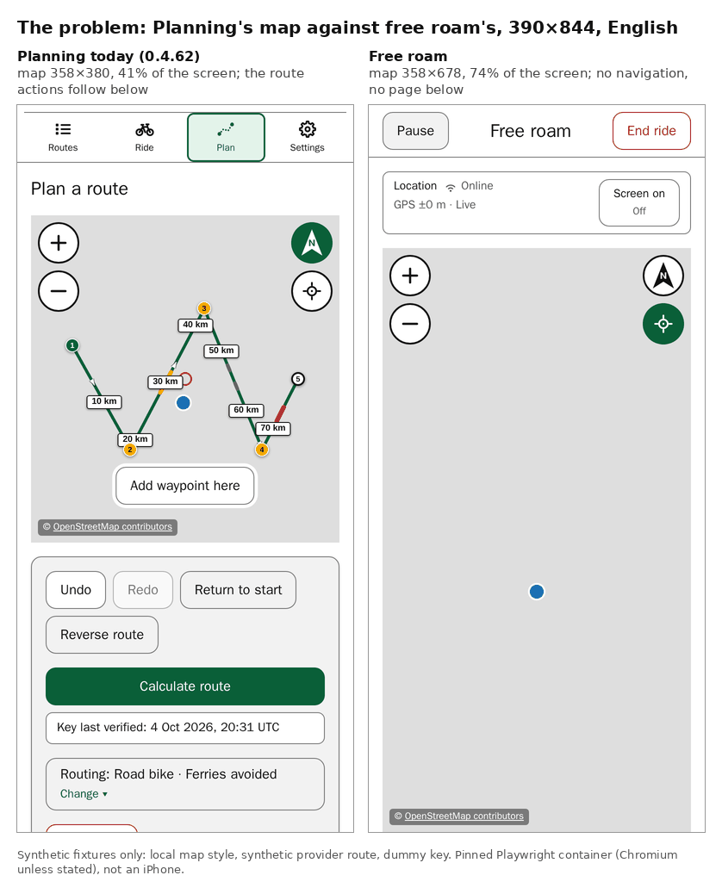
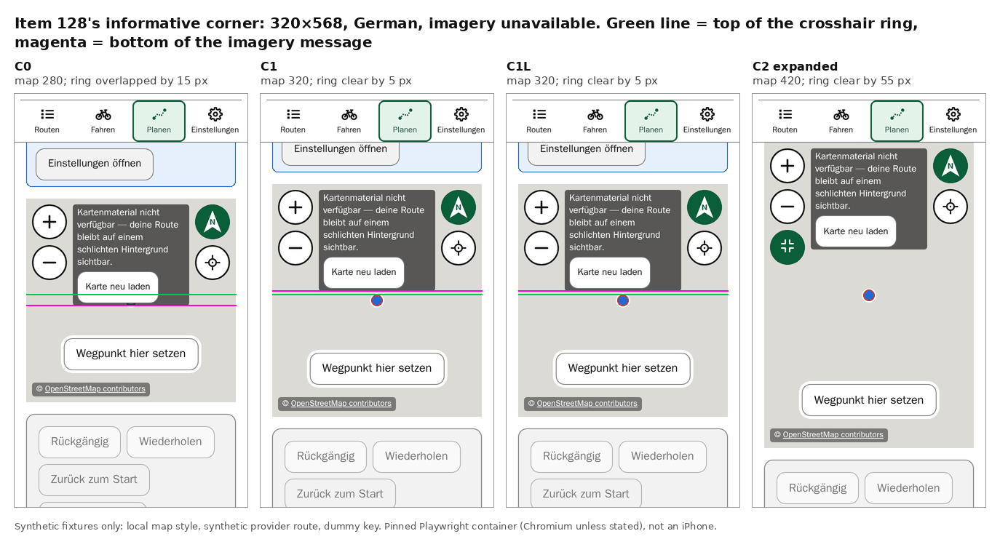
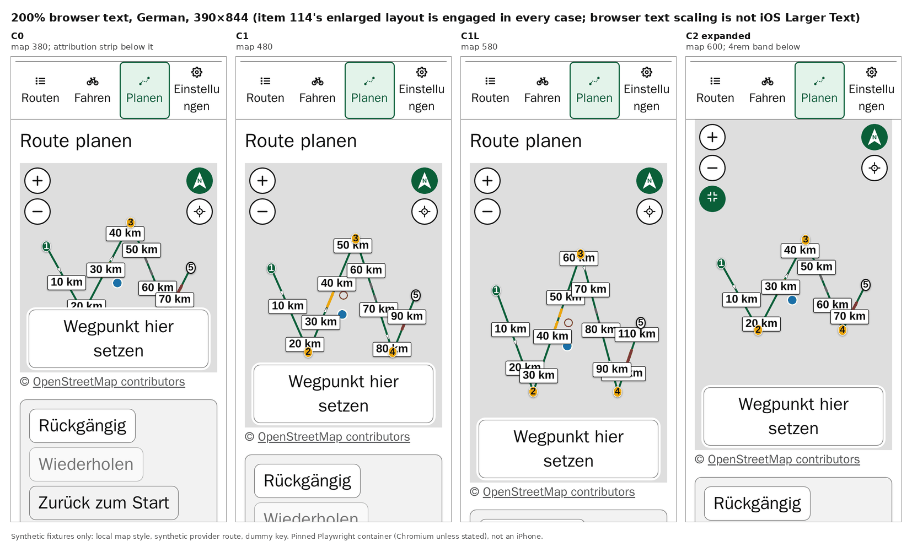
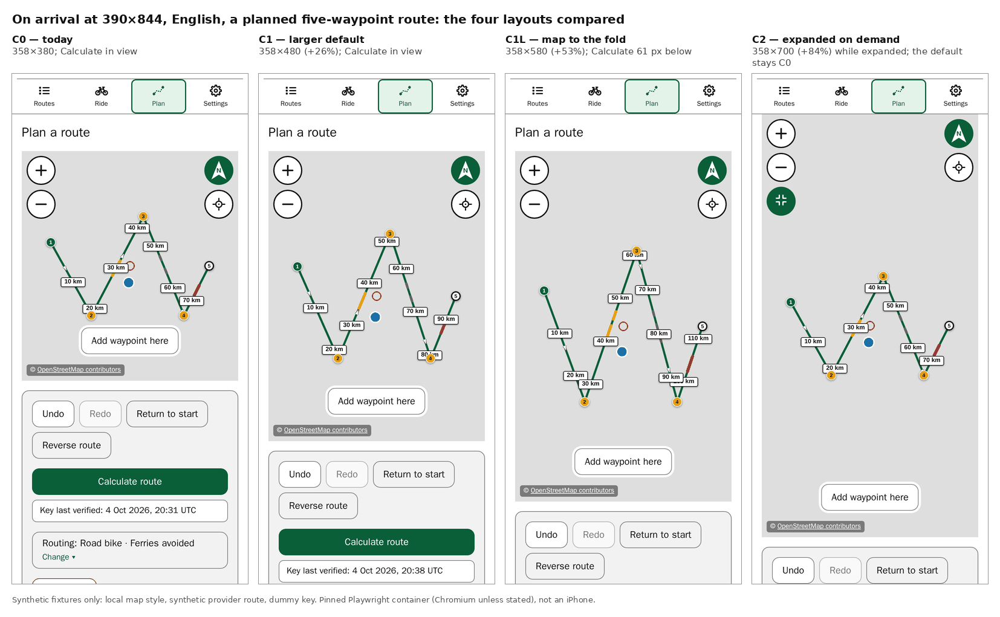
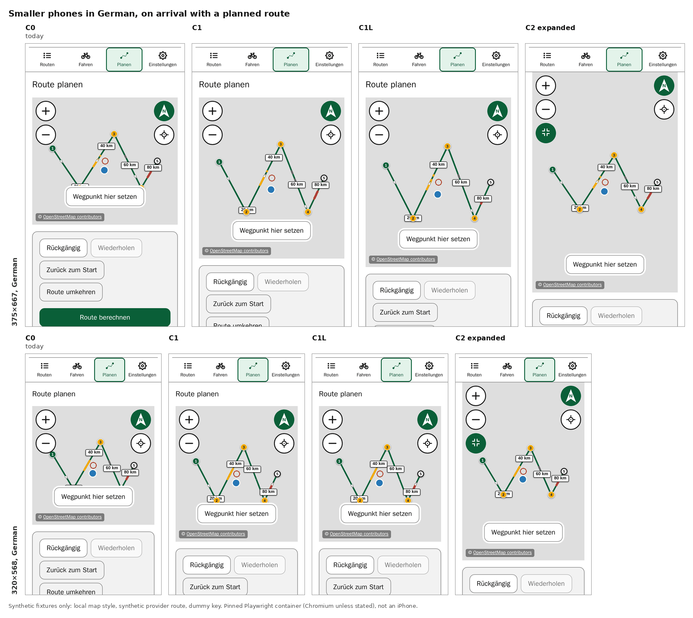
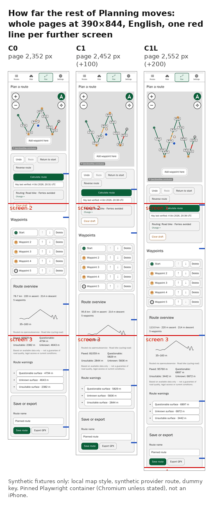
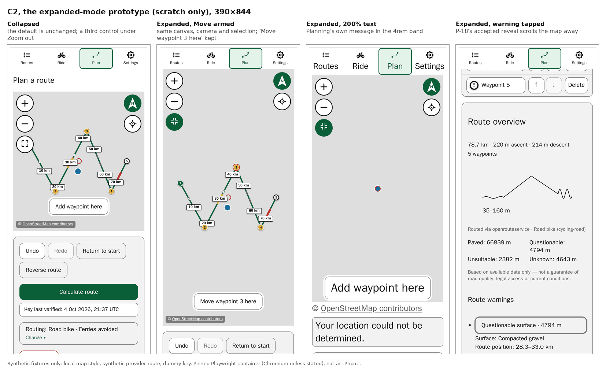

# Item 122 — Planning's map area on a phone: investigation and design

**Status (4 October 2026): investigation and design stage complete; nothing is implemented, and the rider's layout decision is awaited.** This is [item 122](../../project/backlog.md#item-122)'s design-stage report. It measures the current Planning map against three alternatives in scratch builds of `0.4.62` (application source identical to commit `a71ca2f`). No application source, test, stylesheet, dependency, configuration or version changed in the repository. Every candidate here is a disposable scratch build, and none of it is shipped or approved behaviour.

**Update (5 October 2026).** The rider asked for more map than C1's 480 px, with Calculate route visible where practical. A [follow-up report](copy-notice-and-map-size.md) measures 500, 480 and 420 px maps together with [item 141](../../project/history/items-132-NN.md#item-141)'s compact Edit copy notice and an enlarged-text guard. It finds that 500 px keeps Calculate on the first screen only in the zero-inset comparison, and only for some drafts; that comparison does not include the installed PWA's safe-area insets. Everything below is the 4 October record, unchanged.

**Final decisions (5 October 2026).** The rider then decided, as design approvals rather than device acceptance: Calculate route directly below the map, the 480 px rule (`clamp(340px, round(nearest, 56dvh, 20px), 560px)`), and today's height in the enlarged layout ([record](copy-notice-and-map-size.md#final-design-decisions-5-october-2026)). Item 122 is to be implemented after item 141's compact notice and that notice's installed-iPhone acceptance. Item 141 shipped in `0.4.63` on 5 October 2026 ([record](../../project/history/items-132-NN.md#item-141)), and its visual and functional checks were accepted on the installed iPhone the same day.

**The problem.** On the installed iPhone, the Planning map felt too small for planning compared with free roam's map (item 113's first pass, 25 September 2026). Measured at 390×844, Planning's map is **358×380, 41% of the screen**; free roam's is **358×678, 74%**.

**Recommendation: C1, a larger default map with the same page structure — about 56% of the screen height instead of 44%, between 320 and 560 px — at ordinary text only, keeping today's height while item 114's enlarged-text layout is engaged.** The trade-offs and the alternatives are in [Recommendation](#recommendation-and-trade-offs). The choices the rider needs to make are listed in [Decisions for the rider](#decisions-for-the-rider).

- **What C1 gains:** at 390×844 the map becomes 358×480, 26% more area, with Calculate route still in view on arrival. On a 320×568 screen in German, the imagery message no longer overlaps the crosshair: it clears it by 5 px, against today's 15 px overlap.
- **What it costs:** everything below the map moves down by the height gained, 80–100 px on most phones. That is 4–8% more page to scroll.
- **What it must not do:** at 200% browser text, a taller map pushes item 114's below-map imagery message and Retry off the screen. That breaks item 114's accepted contract, so the enlarged layout must keep today's height.
- **The larger alternatives:**
  - **C2, a deliberate expanded-map mode**, gives free roam's size on demand. It brings several product decisions with it.
  - **C1L, a map sized to the fold**, measured worse than both.

These are automated measurements in the pinned Playwright container, never installed-iPhone evidence (see [Limitations](#limitations)).

## Contents

- [The problem and the measured baseline](#the-problem-and-the-measured-baseline)
- [What was tested](#what-was-tested)
- [Three kinds of evidence](#three-kinds-of-evidence)
- [The 20 px snap and the gesture fault](#the-20-px-snap-and-the-gesture-fault)
- [Candidates](#candidates)
- [Results](#results)
- [The expanded mode as a design proposal](#the-expanded-mode-as-a-design-proposal)
- [Recommendation and trade-offs](#recommendation-and-trade-offs)
- [Unresolved evidence](#unresolved-evidence)
- [Decisions for the rider](#decisions-for-the-rider)
- [Optional phone observations](#optional-phone-observations)
- [Limitations](#limitations)
- [Reproducing (a reconstruction)](#reproducing-a-reconstruction)

## The problem and the measured baseline



**The current rule.** `.planning-map-container` (`src/index.css`) has three tiers, each behind its own `@supports` check:

1. a plain `340px`;
2. `clamp(280px, 44dvh, 460px)`;
3. `clamp(280px, round(nearest, 44dvh, 20px), 460px)`.

The minified build writes the last as `round(44dvh,20px)`, `nearest` being the default. Both engines measured here use the third tier: every measured height is a multiple of 20 px.

**The page.** Planning is one scrolling page beneath the sticky navigation:

- the title, and any notice (no key, draft loading, edit copy);
- the map;
- the below-map block (item 114's attribution strip at enlarged text, then Planning's own messages);
- the actions panel: Undo, Redo, Return to start, Reverse route, then Calculate route, the routing disclosure with the profile, and Clear draft;
- the waypoint list;
- the route overview: metrics, elevation chart, surfaces and warnings;
- Save or export.

**Measured on arrival**, with a planned five-waypoint route with three surface warnings, English, 100% text, in Chromium and WebKit. Free roam is measured with the same synthetic location.

| Viewport | Planning map | Share of screen | Page below the map | Free roam's map |
| -------- | ------------ | --------------: | -----------------: | --------------- |
| 390×844  | 358×380      |             41% |             336 px | 358×678         |
| 375×667  | 343×300      |             41% |             240 px | 343×501         |
| 320×568  | 288×280      |             44% |             165 px | 288×402 / 376\* |
| 320×844  | 288×380      |             41% |             341 px | 288×678 / 652\* |
| 375×812  | 343×360      |             41% |             325 px | 343×646         |
| 430×932  | 398×420      |             42% |             381 px | 398×766         |

\* Chromium / WebKit where they differ (free roam's header and status card wrap differently); every Planning map figure is identical in both engines.

**Scrolling needed to bring each part of Planning fully into view from the page's top**, at 390×844 with the planned route:

| Part                 | English, 100% | German, 100% | English, 200% | German, 200% |
| -------------------- | ------------: | -----------: | ------------: | -----------: |
| Calculate route      |             0 |            0 |            52 |          153 |
| Clear draft          |            43 |           62 |           398 |          539 |
| Last waypoint        |           469 |          488 |         1,382 |        2,447 |
| Elevation chart      |           808 |          827 |         1,934 |        3,040 |
| First route warning  |         1,116 |        1,189 |         2,677 |        4,051 |
| Save route           |         1,483 |        1,556 |         3,299 |        4,737 |
| Whole page (routed)  |         2,352 |        2,425 |         4,238 |        5,676 |
| Whole page (no plan) |         1,365 |        1,402 |         2,118 |        2,395 |

Two facts shape every alternative:

- **Every part below the map moves down by exactly the height the map gains.** That was measured at every size, language and text size.
- **Touch scrolling the page needs somewhere to touch that is not the map.** A touch on the map pans the map. At arrival, 55% of the screen below the navigation is outside today's map at 390×844: the title, the 16 px side gutters and the 336 px of page beneath.

## What was tested

|               |                                                                                                                                                                                                                                       |
| ------------- | ------------------------------------------------------------------------------------------------------------------------------------------------------------------------------------------------------------------------------------- |
| Build         | `0.4.62`, application source identical to `a71ca2f`; each candidate a separate `git archive` copy outside the repository, built with the pinned Node 24.18.0 / npm 11.16.0                                                            |
| Container     | `mcr.microsoft.com/playwright:v1.61.1-noble@sha256:5b8f294aff9041b7191c34a4bab3ac270157a28774d4b0660e9743297b697e48`, the E2E workflow's image, by digest (local RepoDigest checked); Node 24.17.0 inside it; bridge network per copy |
| Browsers      | Chromium 149.0.7827.55 and WebKit 26.5 (Playwright's Desktop Chrome and Desktop Safari), the viewport overridden, `deviceScaleFactor` 2 (1 at 1280×720), service workers blocked; touch gestures in Chromium only                     |
| Fixtures      | the E2E suite's own local map style and failure helpers (`e2e/support/localMapStyle.ts`), no live tiles; a synthetic provider answered locally; the suite's `dummy-e2e-key`; a synthetic location; the app's own catalogues           |
| The route     | five waypoints placed by mouse at fixed fractions of the map, then Calculate route: dense synthetic geometry with an elevation profile and three surface warnings (questionable, unknown, unsuitable)                                 |
| Sizes         | 390×844 (the ordinary presentation); 375×667, 320×844 and 430×932 (item 128's required and control sizes); 375×812 and 320×568 (its informative corners); 1280×720 for gestures (the CI `chromium` project's size)                    |
| Text and copy | English and German; 100% and 200% browser root text; item 114's switch points; intermediate sizes for the expanded mode                                                                                                               |

**One fixture caveat.** The waypoints are placed at the same screen fractions in every candidate, so a larger map plans a longer route. The route is 78.7 km at C0, 95.6 km at C1 and 113 km at C1L. The number of waypoints, warnings and page sections is the same in every case.

## Three kinds of evidence

- **Measured** — new results from the scratch probes described in [Reproducing](#reproducing-a-reconstruction), and item 128's own probe re-run from each candidate's copy. Only these count as this stage's findings.
- **Recorded** — earlier measurements, quoted with their source (the interface migration's history, item 21, items 114 and 128).
- **Source-reasoned** — inferences from the CSS, JSX or MapLibre source, labelled as such.

## The 20 px snap and the gesture fault

**Recorded.** During the interface migration, certain map-container heights left MapLibre's drag-rotate/pitch handler permanently "active": `movestart`, `move` and `rotate` fired, but `moveend` and `rotateend` never did ([history](../../project/history/interface-accessibility-migration.md)). The fault depended on the height, not on fractions: a whole-pixel 331 px failed exactly like 331.1875 px. Planning shipped without the snap and then failed exactly that way in CI, at an unsnapped 44dvh (about 316.8 px at 1280×720). Extensive local attempts at the same height never reproduced it. The `round()`-snapped 20 px tier was reinstated in `0.3.4`. Later, [item 21](../../project/history/items-06-29.md#item-21) replaced the e2e suite's right-button drags with MapLibre's keyboard handler, which "cannot reproduce the stuck-gesture failure by construction".

**So no existing test performs a genuine drag with end events.** This stage built one.

- **The gestures:**
  - a right-button drag that rotates, pitches, or both, released slowly or flung so that MapLibre's inertia runs;
  - a left-button pan, slow and flung;
  - a wheel zoom;
  - in Chromium, two-finger rotate and pitch through the browser's touch protocol.

  Rotations always exceed MapLibre's ±7° snap to north, which would otherwise ease back to a bearing of 0 and look exactly like the old symptom.

- **The verdict.** "Completed" requires all of these:
  - every gesture that actually started (`dragstart`, `rotatestart`, `pitchstart`, `zoomstart`) reached its end event, and the final `moveend` arrived;
  - `map.isMoving()` was false and every MapLibre handler reported itself inactive;
  - no `resize` occurred in the window, and no further pointer input was sent between release and verdict.
- **The bound, source-reasoned from MapLibre 6.6's constants.** The longest inertial ease is a flung pan, at most about 1.87 s; a bearing ease at most 1.2 s; a pitch ease 0.3 s; a wheel zoom about 0.4 s including its 200 ms finish timeout. The verdict allows 4 s after release, or 10 s under CPU throttling.
- **No release-event identity is required.** The source sets an end event's `originalEvent` to the release only when one was delivered: an inertial ease or a wheel ends with other events. A `resize` calls `stop()`, which ends any active handler first.
- **Why the stricter criteria.** `onCameraSettled`, and so the `data-camera-*` attributes, fire on any `moveend`. MapView resizes the map from its ResizeObserver and before every camera command, and any later mouse move with the button up also resets a drag. Without these criteria, a stuck handler could be "healed" and read as a pass.
- **The positive control.** One drag per case has its release swallowed by a capture-phase listener on the window. It must read **stuck**, with `dragRotate.isActive()` true, and after a forced 1 px resize it must read **healed by resize**, not completed. It did, in every repeat.

**A finding about MapLibre, not about heights (measured, then source-confirmed).** The first screening runs reported "stuck" drags at 320×568, in both engines. They were traced to the probe's fixed drag vectors releasing **outside MapLibre's container**: over the North-up/Locate cluster, which is a sibling of the map rather than its child, or past the map's edge.

- **The mechanism.** MapLibre 6.6's drag handlers take `mouseup` from the map element only (`handler.mouseup = dragEnd`), while they track moves on the window. A release outside that element is never seen, and the handler stays active until the pointer moves again or the map resizes.
- **It happens on today's build too.** It affects every height equally. In 481 of 494 repeats a single ordinary pointer move afterwards healed it; in the other 13, that one move had not within 800 ms. Real mouse use nearly always moves the pointer, and a touch's end is delivered to its own target.
- **What the probe does now.** It releases only at points verified to lie inside the map element, and keeps one deliberate "release outside" case per size to record this behaviour separately.
- **A hypothesis, not established:** a fixed-pixel test drag can end over a sibling control at some heights and not others, which would look height-specific. Whether that explains any of the historical CI failures is not shown here.

**Results.** Every "inside" gesture completed: 5,408 in all, over C0 and the three candidates.

| Build                 | Heights exercised (px)                                    | Chromium, plain | Chromium, 4× CPU | WebKit\* |
| --------------------- | --------------------------------------------------------- | --------------: | ---------------: | -------: |
| C0                    | 280, 300, 320, 360, 380, 420                              |         351/351 |            70/70 |  270/270 |
| C1                    | 320, 380, 400, 460, 480, 520                              |         630/630 |            70/70 |  515/515 |
| C1L                   | 320, 400, 460, 560, 580, 680                              |         630/630 |            70/70 |  515/515 |
| C2, expanded          | 420, 520, 580, 680, 700, 800                              |         630/630 |            70/70 |  515/515 |
| Sweep at 390×844 (C0) | every 20 px from 280 to 820, by override                  |         336/336 |                — |  336/336 |
| Historic heights (C0) | 316.797, 331, 331.1875, 320, 340 at 1280×720, by override |         200/200 |                — |  200/200 |

\* WebKit includes one run in a container limited to 2 CPUs; WebKit has no CPU-throttling protocol.

**What this does and does not establish.** No candidate height produced a stuck gesture here. Nor did the heights that failed historically, so this harness cannot reproduce the original fault. It detects a stuck handler, as the positive control proves, but nothing local triggers one. The result is **no fault observed, not safety proven**. Every candidate keeps the 20 px snap. The implementation stage should add a genuine-drag e2e test with this positive control at the chosen heights, so that CI — the only place the fault ever appeared — keeps watching.

## Candidates

Each candidate is the unchanged `0.4.62` source plus one minimal change, with the same scratch-only instrumentation in every copy, C0 included (quoted in [Reproducing](#reproducing-a-reconstruction)).

| Candidate | Change                                                                                                                                                                                                            |  Height at 390×844 | Why this size                                                                                                                                                                                                  |
| --------- | ----------------------------------------------------------------------------------------------------------------------------------------------------------------------------------------------------------------- | -----------------: | -------------------------------------------------------------------------------------------------------------------------------------------------------------------------------------------------------------- |
| **C0**    | none                                                                                                                                                                                                              |                380 | today                                                                                                                                                                                                          |
| **C1**    | a larger default, same structure: 400 px, then `clamp(320px, 56dvh, 560px)`, then `clamp(320px, round(nearest, 56dvh, 20px), 560px)`                                                                              |                480 | keeps Calculate route in view on arrival at 390×844 in both languages, 39 px to spare (500 px, about 59%, is the largest snapped height that still would); its 320 px floor clears 320×568's crosshair overlap |
| **C1L**   | the map to the fold: 480 px, then `clamp(320px, calc(100dvh - 248px), 680px)`, then `clamp(320px, round(down, calc(100dvh - 248px), 20px), 680px)`                                                                |                580 | 248 px = the 128 px above the map at ordinary text, plus a 120 px strip left below for the next row and for touch scrolling                                                                                    |
| **C2**    | an expanded mode on demand (prototype): a third map control under Zoom out, in flow, growing the same map to the screen below the navigation less a fixed 4rem band, snapped down to 20 px; the default unchanged | 700 while expanded | free roam's size, only when wanted                                                                                                                                                                             |

Calculate route being in view on arrival was treated as a benefit to weigh, not a requirement: a larger map may reasonably need more scrolling, and the cost is measured below.

**Considered, not built.** A fixed full-screen map, more like free roam, with no page beneath it. It would need a new home for the attribution and Planning's messages, and for item 114's strip at enlarged text, and it adds no measurement the in-flow prototype lacks. A map that stays sticky while the list scrolls was set aside too: it takes the screen from the waypoint and warning work the map is meant to share it with.

## Results

### Dimensions and snapping

**Measured map heights**, identical in Chromium and WebKit:

| Viewport |  C0 |  C1 | C1L | C2 expanded, 100% | C2 expanded, 200% (EN / DE) |
| -------- | --: | --: | --: | ----------------: | --------------------------: |
| 390×844  | 380 | 480 | 580 |               700 |                   620 / 600 |
| 375×667  | 300 | 380 | 400 |               520 |                   440 / 420 |
| 320×568  | 280 | 320 | 320 |               420 |                   340 / 320 |
| 320×844  | 380 | 480 | 580 |               700 |                   620 / 600 |
| 375×812  | 360 | 460 | 560 |               680 |                   600 / 560 |
| 430×932  | 420 | 520 | 680 |               800 |                   720 / 680 |
| 1280×720 | 320 | 400 | 460 |               580 |                           — |

The width is always the screen less 32 px. C0, C1 and C1L do not change with text size; C2's expanded height does, through its rem band and the taller navigation at 200%.

- **Every height is a multiple of 20.** The `round()` tier is in effect in both engines.
- **The fallback tiers** (source-reasoned) would give C1 `56dvh`, unsnapped (472.6 px at 844), and C1L `100dvh − 248px`, unsnapped. Only an engine without CSS `round()` uses them. Safari supports it from 15.4, so on the installed iPhone the snapped tier applies.

### Crosshair and placement

- **The ring** stays at the map's centre in every candidate.
- **Placement works:** both the mouse clicks that placed every route here and item 123's touch tests on the placement control, below.
- **C1L's exception:** its fold-anchored height ignores notices above the map. With the no-key notice shown, the map's bottom, attribution included, falls below the screen at 390×844 and 320×844. Item 123's touch tests fail their "map wholly in view" precondition there (10 failures), and a keyboard pan in another test no longer separated two placements, which landed together.

### Items 114 and 128: imagery message, Retry, attribution and placement control

Item 128's probe was re-run from each candidate's copy, its height function matched to the candidate, in both engines. Its stages: the 16 required cases, the corners, co-occurrence with Planning's own messages, just below item 114's switch, the switch points, 80 live transition steps, and appear, change and clear sequences.

| Check                                                 | C0                          | C1                   | C1L                  |
| ----------------------------------------------------- | --------------------------- | -------------------- | -------------------- |
| Required sizes, imagery alone (16 cases)              | pass; ring clear by ≥ 29 px | pass; ≥ 69 px        | pass; ≥ 79 px        |
| With Planning's own message (32)                      | pass; ≥ 29 px               | pass; ≥ 69 px        | pass; ≥ 79 px        |
| Just below item 114's switch (32)                     | pass; ≥ 23 px               | pass; ≥ 32 px        | pass; ≥ 42 px        |
| Either side of item 114's switch, and 200% (48)       | switches as expected        | switches as expected | switches as expected |
| Transitions (80 steps) and sequences (≈ 2,900 frames) | clean                       | clean                | clean                |
| **320×568, German** (informative corner)              | **overlap 15 px**           | **clear by 5 px**    | **clear by 5 px**    |



- **The 320×568 German case is today's recorded overlap, reproduced exactly** in both engines. C1 and C1L clear it only through their 320 px floor: the ring moves from 132 to 152 px while the German message still ends at 147. A 340 px floor would give 15 px. In C2's expanded state the ring clears by 55 px, but its collapsed default keeps the overlap.
- **Item 128's sheet for C1** is [`08-item128-recheck-C1.png`](images/08-item128-recheck-C1.png). The probe titles it "Implemented C6", which names item 128's shipped layout; every candidate keeps that layout.
- **Item 114 is broken by a taller map at enlarged text.** At 200%, the enlarged layout puts the imagery message and Retry in flow below the map, and its accepted e2e contract requires them on screen whenever the map is wholly in view.
  - **C1** pushes them off at 375×667 (English and German) and 320×844 (German), in both engines: 6 failures.
  - **C1L** does so at 390×844, 320×844 and 375×667, in both languages: 13 failures.
  - **C2 expanded** does too: its 4rem band cannot hold the 265–405 px message, so Retry lies below the screen at every size measured.

  Hence the recommendation's condition: keep today's height whenever the enlarged layout is engaged. That guard was **not prototyped**, and its interaction with item 114's 0.25 rem hysteresis needs its own measurement.



### Planning's own messages below the map

- **Appearing and clearing moves nothing:** not the map, the canvas, the ring or the placement control, in any candidate (item 128's sequences; for C2 expanded, the probe).
- **In C2 expanded**, the Locate-failed message appears in the 4rem band without moving or resizing the map at every size, both languages and 100% and 200% text. The exception is 320×568 at 200%, where the band is too small and the message falls below the screen.

### The existing tests against each build

The Planning-related specs (22 files: Planning, its imagery, enlarged text, placement, touch, warnings and their map reveal, Android Planning, gestures, direction arrows, camera framing, Clear draft, confirmation reveals, saved routes, distance badges, sticky navigation, layout) were run against each build. WebKit runs only the `*.smoke` specs and the Pixel-7 project only `android*`, as in CI; the rest are Chromium only. Each run first confirmed it was served its own build's stylesheet. Every unexpected failure was rerun five times on the candidate and on C0.

| Build | Passed | Failed | What the failures are                                                                                                                                                                                                                                                                                                                                                                                                                                                                                                       |
| ----- | -----: | -----: | --------------------------------------------------------------------------------------------------------------------------------------------------------------------------------------------------------------------------------------------------------------------------------------------------------------------------------------------------------------------------------------------------------------------------------------------------------------------------------------------------------------------------- |
| C0    |    351 |      0 | —                                                                                                                                                                                                                                                                                                                                                                                                                                                                                                                           |
| C1    |    340 |     11 | **6 real:** item 114's discoverability at 200%, as above. **4 premises:** one test pins the 280 px floor (the property it guards, no switch at the floor at 100%, still holds at 320); two need the Save confirmation to fit without moving, and with a taller map it no longer fits, so item 124's rule moves it, 81.6 px; one needs a warning to "already fit" at 390×1900, and it now moves 38 px. In both, the same specs' tests of the non-fitting branch pass. **1 flake:** a WebKit tile-error timeout, 5/5 on rerun |
| C1L   |    323 |     28 | **13 real:** discoverability at 200%. **11 real:** the map not wholly in view below the no-key notice (10 touch-placement tests, 1 north-arrow test). **4 premises:** as C1 (158 px at 390×1900)                                                                                                                                                                                                                                                                                                                            |
| C2    |    349 |      2 | **1 test list:** the arrow-direction test excludes the North-up and Locate buttons from its pixel analysis by name, so the new control's icon was read as route arrows (0/5 on C2, 5/5 on C0). **1 flake:** a WebKit saved-route test, 5/5 on rerun                                                                                                                                                                                                                                                                         |

Any implementation would update the premise tests deliberately, with the reason, rather than relax what they protect.

### P-18: a warning selected on the map

| Build       | Page movement to reveal the warning, 390×844 EN / DE, 100% | 375×667 EN / DE, 100% | Row and details in the band                 |
| ----------- | ---------------------------------------------------------- | --------------------- | ------------------------------------------- |
| C0          | 1,199 / 1,289 px                                           | 1,313 / 1,455 px      | yes, every case                             |
| C1          | 1,299 / 1,389 px                                           | 1,393 / 1,535 px      | yes, every case                             |
| C1L         | 1,399 / 1,489 px                                           | 1,413 / 1,555 px      | yes, every case                             |
| C2 expanded | 1,458 / 1,548 px                                           | 1,473 / 1,615 px      | yes; and the expanded map leaves the screen |

- **The accepted reveal keeps working** in every candidate, in both engines and both languages, at 100% and 200%. The selected row and its two detail lines come to rest at the band's bottom, and the movement grows by exactly the height the map gained.
- **C2 is the exception, by design:** selecting a warning on the expanded map scrolls the page to the row and the map out of view (sheet 7).
- **Method:** measured with the P-18 spec's own wait, and confirmed by the spec itself against each build.

### Map area against scrolling



| Viewport, English, 100% | Map area: C1 / C1L / C2 expanded vs C0 | Extra scroll to everything below: C1 / C1L | Calculate on arrival: C0 / C1 / C1L | Page below the map on arrival: C0 / C1 / C1L |
| ----------------------- | -------------------------------------- | ------------------------------------------ | ----------------------------------- | -------------------------------------------- |
| 390×844                 | +26% / +53% / +84%                     | +100 / +200 px                             | yes / yes / 61 px below             | 336 / 236 / 136 px                           |
| 375×667                 | +27% / +33% / +73%                     | +80 / +100 px                              | yes / 37 px below / 57 px below     | 240 / 160 / 140 px                           |
| 320×568                 | +14% / +14% / +50%                     | +40 / +40 px                               | 84 / 124 / 124 px below             | 165 / 125 / 125 px                           |
| 430×932                 | +24% / +62% / +90%                     | +100 / +260 px                             | yes / yes / 76 px below             | 381 / 281 / 121 px                           |





- **C1's cost is modest and uniform:** 4–8% more page, Calculate still in view on most phones, and over 230 px of page below the map to scroll by at 390×844.
- **C1L leaves 121–141 px below the map on arrival** on every phone, the only practical place to start a touch scroll other than the 16 px gutters. It pushes Calculate below the screen everywhere.
- **C2 changes nothing until it is used.** While expanded, only a 65–81 px band and the gutters lie outside the map.

### The expanded mode, measured (C2 prototype)



- **Camera and selection.** Entering and leaving kept the same canvas and the camera's centre, zoom, bearing and pitch, in both engines. A selected waypoint and its pending Move ("Move waypoint 3 here" / "Wegpunkt 3 hierher verschieben") stayed armed throughout.
- **No refit.** A route fitted to the small map stays that size when expanded (sheet 2), and one fitted while expanded is clipped after collapsing (source-reasoned).
- **Scrolling while expanded hides the exit.** After the rider wheels 300 px down while expanded, the collapse control has scrolled away with the map's corner, in every case and both engines. The rider would have to scroll back to leave.
- **Exit positions,** measured with the press dispatched in the page, identical in both engines:

  | Policy  | Rider did not scroll while expanded  | Rider scrolled 300 px while expanded       |
  | ------- | ------------------------------------ | ------------------------------------------ |
  | Keep    | map's top stays under the navigation | stays scrolled: the map's top 233 px above |
  | Restore | back to where it was before (0)      | back to where it was before (0)            |
  | Map top | map's top under the navigation       | map's top under the navigation             |

- **Item 114's switch flips on toggling at some text sizes.** At 375×667 between 112% and 120%, and at 320×568 at 104%, the collapsed map is in the enlarged layout and the expanded one is not. Expanding moves the attribution into the map, and collapsing moves it back out.
- **P-18:** described above.

## The expanded mode as a design proposal

If the rider wants C2, these are its open product choices. They are proposals, not permission to build it.

- **Entry and exit.** One map control, `aria-pressed`, labelled "Expand map" / "Collapse map", placed under Zoom out so that the right-hand North-up/Locate order stays as it is. Escape needs care: `ConfirmDialog` already owns it, and a document-level handler would also collapse the map while Clear draft's confirmation is open.
- **Keeping the exit reachable.** Either keep the collapse control pinned to the screen while expanded, or stop the page scrolling while expanded. Otherwise, as measured, a rider who scrolls loses the way out.
- **Placement controls.** Unchanged: the crosshair and its placement button stay at the map's centre and bottom. Undo is not in the map's chrome, so leaving the mode is the way to reach it, unless an Undo is added there — a further decision.
- **The rest of Planning.** Below the expanded map, reached by leaving the mode or by scrolling in the band. The exit position is the rider's choice from the table above: "restore" returns to where the rider was; "map top" keeps the map in view.
- **Camera and selection.** Kept, as measured. Whether to refit the route on entry and on exit is a decision: today nothing refits.
- **Warnings selected on the expanded map.** P-18's accepted reveal scrolls away from the map. The options: keep it; show the details without scrolling while expanded; or leave the mode and then reveal. Each would need its own acceptance.
- **Enlarged text.** The band cannot hold the imagery message and Retry at 200%, and the switch flips at intermediate sizes. The options: do not offer the mode while the enlarged layout is engaged; or size the band from the text, measured anew.

## Recommendation and trade-offs

**Recommended: C1, at ordinary text only.** The map grows to about 56% of the screen height, 320 to 560 px, snapped to 20 px as now, and keeps today's 44dvh height whenever item 114's enlarged layout is engaged.

- **Why C1:**
  - a material gain (+26% at 390×844, +27% at 375×667) with the same single-page structure;
  - no new control, mode or decision about where the rider ends up;
  - Calculate route still in view on arrival on most phones;
  - item 128's crosshair checks pass with more clearance, and the 320×568 German overlap is resolved;
  - no gesture fault observed at any of its heights.
- **What it costs:**
  - 40–100 px more scrolling to everything below the map;
  - four tests whose premises need deliberate updating;
  - the enlarged-text guard, which is unmeasured and must be measured in the implementation stage.
- **What it does not do:** reach free roam's size. 480 px is 71% of free roam's 678 at 390×844.

**C2, if the rider wants free roam's size.** It is the only option that gets there without changing the page for everyone else. It costs a new control and the design decisions above, and it fails item 114's discoverability while expanded at enlarged text unless the mode is withheld there. It can follow C1 later; the two do not conflict.

**C1L: not recommended.**

- It gains more than C1 by default (+53%), but pushes Calculate below the screen on every phone.
- It leaves a narrow 121–141 px scroll strip.
- Its fold arithmetic is wrong whenever a notice sits above the map, as the 11 test failures show.
- It breaks item 114's discoverability at more sizes.

A fold-anchored height would need measuring in script rather than CSS, which is a larger change than this stage's evidence justifies.

**No change** remains possible. Today's layout passes everything measured here except the known 320×568 German overlap.

## Unresolved evidence

- **The gesture fault was never reproduced locally**, including at the exact heights that failed in CI before. The new heights show no fault here, which is not proof. CI evidence from a genuine-drag test at the chosen heights is the outstanding check.
- **iOS Safari is untested:** real touch, real inertia, and `dvh` with the installed PWA's standalone chrome. Desktop WebKit is not iOS Safari, and no candidate was put on a phone.
- **How large is large enough** is subjective, and only the rider can judge it on the device.
- **C1's enlarged-text guard** was not prototyped. Its interaction with item 114's switch and hysteresis is unmeasured.
- **The expanded mode is a prototype.** Its exit behaviours, its reserved band and its interplay with P-18 are measured on that prototype, not on a design.
- **Safe-area insets** were not simulated for the candidates: C2's band subtracts `--safe-area-inset-bottom`, which is 0 px in these engines.
- **A finger scrolling during P-18's reveal,** and Reduce Motion, were not exercised.

## Decisions for the rider

1. **The direction:** C1 (recommended); C2; C1 now and C2 later; C1L; or no change.
2. **If C1, its size:** 56% of the screen height (480 px at 390×844), or another share. The trade-off is the area gained against Calculate's place on arrival, which C1 keeps in view at 390×844 but not at 375×667.
3. **If C1 or C1L, the floor:** 320 px (clears 320×568's German overlap by 5 px), 340 px (by 15 px, with more of a short screen given to the map), or today's 280 px (the overlap remains).
4. **Enlarged text:** keep today's height while item 114's enlarged layout is engaged (recommended, preserving its accepted contract); or accept that the imagery message and Retry need scrolling at 200%, which would revise item 114.
5. **If C2, each of the choices in [the design proposal](#the-expanded-mode-as-a-design-proposal):**
   - the control and its place;
   - how the exit stays reachable;
   - the exit position;
   - refitting on entry and exit;
   - P-18 while expanded;
   - enlarged text.
6. **Tests:** whether the implementation stage should add a genuine-drag e2e test with the positive control at the chosen heights. It would be the only check that can catch the CI-only gesture fault.

## Optional phone observations

These are on the deployed `0.4.62`, as installed: there is no candidate on the phone, and nothing here is an acceptance check. Each informs one decision above.

- [ ] **Plan a typical ride's waypoints at your usual zoom.** Does the map feel too small mainly while placing waypoints across the region, or also while reviewing the route? This informs decision 1: placing alone favours an on-demand mode; both favour a larger default.
- [ ] **On the first screen, after you calculate,** do you want Calculate route and the actions panel still in view, or would you rather scroll to them for a bigger map? This informs decision 2.
- [ ] **When you move between the map and the waypoint list or warnings,** do you do so by scrolling the page, or would a single control be quicker? This informs whether C2's mode would be used, and its exit position.

## Limitations

- **Not iPhone evidence.** Desktop Chromium and WebKit in the pinned container, with its fonts, which have not predicted iOS widths before (item 113). Browser root-text scaling is not iOS Larger Text, and ACN has no Dynamic Type opt-in.
- **Synthetic throughout:** the provider, the route, the location, the key and the map style. The maps are a plain local style, with no tiles.
- **Prototypes, not implementations.** The candidates are scratch builds. C2's mode is a minimal prototype, including a scratch-only exit-policy switch.
- **Not run:** landscape (retired 9 September 2026), physical Android, VoiceOver and a physical keyboard. Item 128's sheets cover its required sizes only; 320×568 comes from the probe's own captures.

## Reproducing (a reconstruction)

The request made the probes temporary, so they are **not committed**. This section records exactly what was run, so that the measurements can be reconstructed; it is not a runnable script in the repository.

**1. Copies and builds.** Each candidate is `git archive a71ca2f` extracted outside the repository, with a copy of `node_modules`, the instrumentation patch below, its own change, and `npm run build` under Node 24.18.0 (each build log checked for success, and the built CSS checked for the rule).

**2. Browsers.** Inside the image above, by digest, with the copy mounted at `/work`, `npx vite preview --port 4173 --strictPort` on the container's own network, and then:

- the layout probe (Planning on arrival, empty and planned, every size, language and text size; free roam's map);
- the gesture probe (the verdicts above);
- the P-18 and C2 probes;
- item 128's `capture.mjs` from the copy's own `docs/design/planning-imagery-banner/`, its `mapHeightFor` matched to the candidate, with `ITEM128_CANDIDATES=C0`, `ITEM128_BASE_URL`, and the stages `baseline`, `candidates`, `candidates` with `ITEM128_SIZES=corners`, `cooccurrence` with and without `ITEM128_TEXT=below`, `textsize`, `transitions`, `sequence` and `sheets` with `ITEM128_SHEETS=implemented`;
- the 22 spec files with `npx playwright test <files> --workers=12`, and failed tests rerun with `--repeat-each=5` on the candidate and on C0.

**3. The scratch instrumentation**, identical in every copy including C0, at the end of `createMapLibreMap` in `src/map/mapAdapter.ts`:

```ts
// SCRATCH INSTRUMENTATION — item 122 design stage only; never committed.
{
  const w = window as unknown as { __acnMaps?: unknown[] };
  const registry = (w.__acnMaps ??= []);
  const log: { type: string; t: number; orig: string | null; moving: boolean }[] = [];
  registry.push({ map, log, container });
  const on = map.on.bind(map) as unknown as (
    type: string,
    listener: (event: { originalEvent?: Event }) => void,
  ) => void;
  for (const type of [
    "movestart",
    "moveend",
    "dragstart",
    "dragend",
    "rotatestart",
    "rotateend",
    "pitchstart",
    "pitchend",
    "zoomstart",
    "zoomend",
    "resize",
  ]) {
    on(type, (event) => {
      log.push({
        type,
        t: performance.now(),
        orig: event.originalEvent?.type ?? null,
        moving: map.isMoving(),
      });
    });
  }
}
```

**4. C1 and C1L** change only the three tiers quoted in [Candidates](#candidates).

**5. C2** keeps the default tiers and adds this CSS after them:

```css
.planning-map-container.planning-map-container--expanded {
  height: max(280px, calc(100dvh - var(--planning-expanded-top, 64px) - 4rem));
}

@supports (height: round(down, 100dvh, 20px)) {
  .planning-map-container.planning-map-container--expanded {
    height: max(
      280px,
      round(
        down,
        calc(
          100dvh - var(--planning-expanded-top, 64px) - 4rem -
            var(--safe-area-inset-bottom, 0px)
        ),
        20px
      )
    );
  }
}
```

**C2's `PlanningScreen.tsx` additions:**

- `isMapExpanded` state;
- a layout effect that publishes the navigation's bottom as `--planning-expanded-top` and scrolls the map's top to it on entry; on exit it applies a scratch-only `window.__planningExitPolicy` of `keep`, `restore` or `maptop`;
- the expanded class on the map container;
- the third control, a 48 px `planning-map-control` with a four-corner icon, `aria-pressed` and the labels "Expand map" / "Collapse map".
