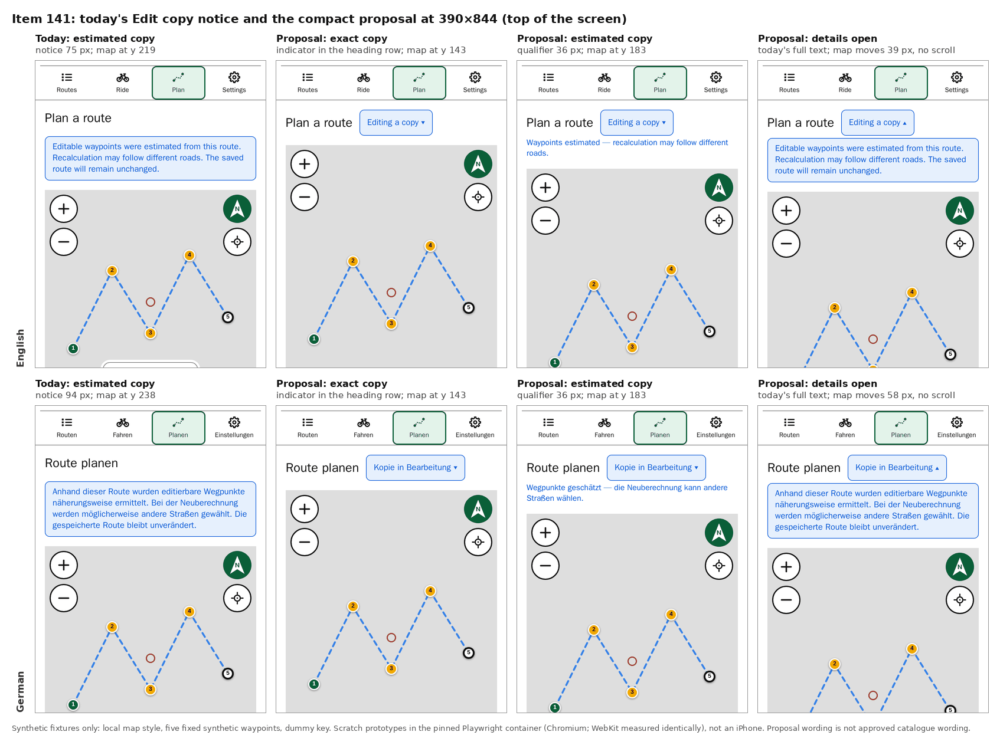
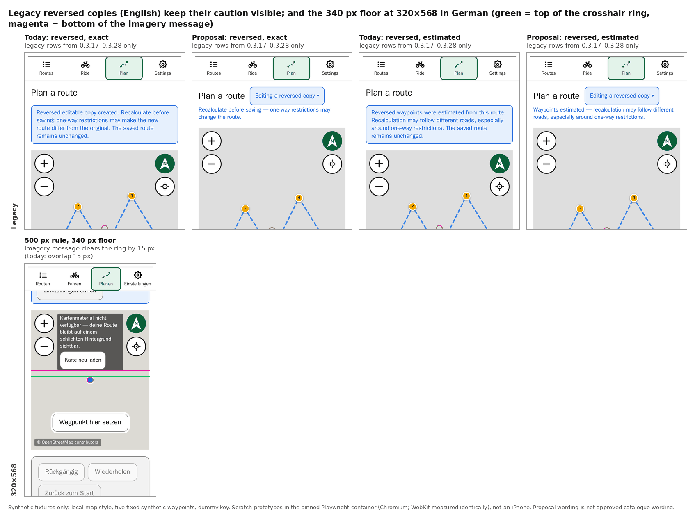
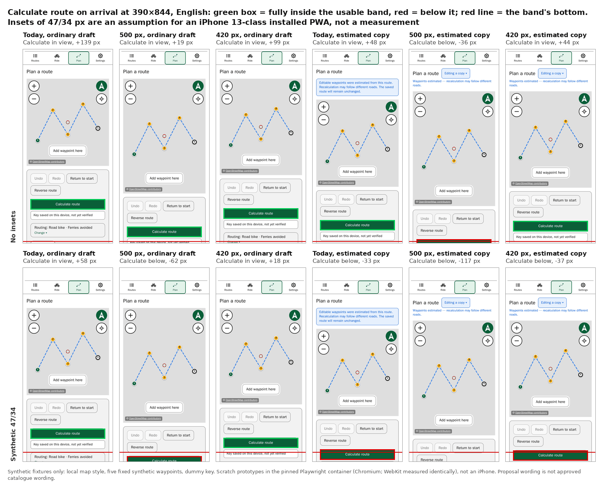
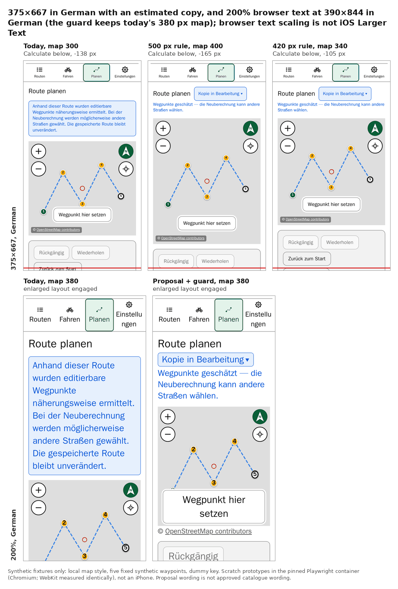
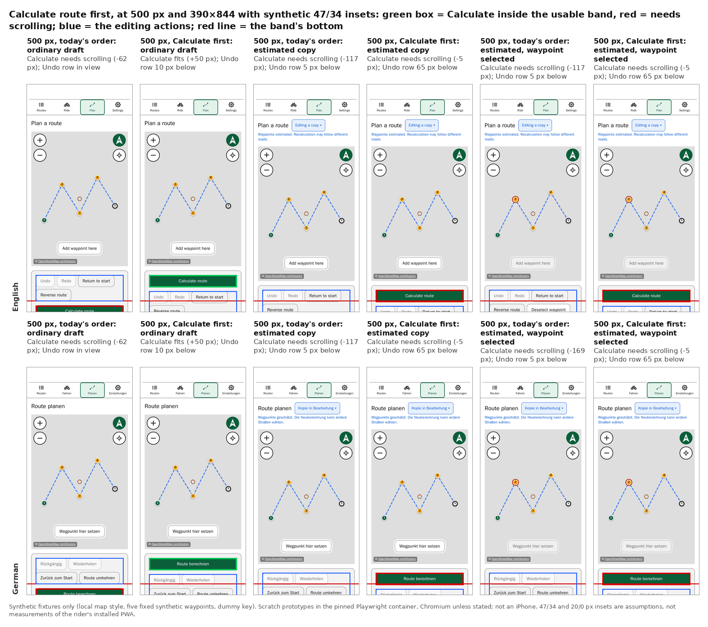
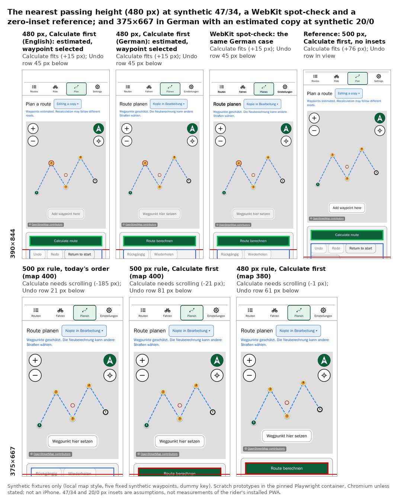

# Items 141 and 122 — a compact Edit copy notice and an intermediate Planning map

**Status (5 October 2026): a design proposal for the rider's combined decision. Nothing is implemented, and none of the wording below is approved catalogue text.**

**Update (5 October 2026, later):** the rider approved the compact notice's direction, and a Calculate-first order was compared. See [Approved direction and the Calculate-first comparison](#approved-direction-and-the-calculate-first-comparison-5-october-2026). The sections between here and there are the earlier record of the same day.

**Final decisions (5 October 2026):** the rider then took the final design decisions for both items. See [Final design decisions](#final-design-decisions-5-october-2026), the newest record: item 141's notice is to be implemented first, then item 122's map and action order.

**Implemented and accepted (5 October 2026):** item 141's notice shipped in `0.4.63` ([record](../../project/history/items-132-NN.md#item-141)), and its visual and functional checks were accepted on the installed iPhone in German and English, with VoiceOver not checked; item 122's implementation follows.

This refines [item 122's report](README.md), which is not repeated here, and gives [item 141](../../project/history/items-132-NN.md#item-141) its visual proposal. Everything was measured on scratch builds of `0.4.62` (application source identical to `5b2d295`), outside the repository, in the pinned Playwright container by digest: Chromium 149 and WebKit 26.5, which measured identically wherever both ran. **None of it is installed-iPhone evidence.**

## Summary

- **The compact notice saves 36–76 px at 390×844 without losing any meaning.**
  - The "editable copy" indication moves into the heading's row.
  - Estimated and legacy reversed copies keep a short qualifier visible: for estimated waypoints, that they were estimated and that recalculation may follow different roads.
  - Today's full text sits in a disclosure, closed by default.
  - At 200% text in German it saves 234 px.
- **A 500 px map (60dvh, snapped to 20 px, 340–560 px) keeps Calculate route fully visible on arrival only in the zero-inset comparison, and only for some drafts:**

  | Draft                            | Calculate                           |
  | -------------------------------- | ----------------------------------- |
  | Ordinary                         | 19 px to spare                      |
  | Exact copy                       | 4 px to spare — too thin to rely on |
  | Estimated copy                   | 36 px below                         |
  | German, with a waypoint selected | 33 px below                         |

- **With insets assumed for an iPhone 13-class installed PWA** (47 px top, 34 px bottom; an assumption, not a measurement), **no map above 420 px keeps Calculate visible, even for an ordinary draft.** At 500 px it lies 62 px below. Today's own full notice already puts it 33–52 px below in that comparison.
- **The nearest useful compromise is 420 px (50dvh).** It keeps Calculate visible in the synthetic-inset comparison for an ordinary draft (18 px spare) and an exact copy (3 px), but not for an estimated copy (37 px below). That is less map than the 480 px the rider wants exceeded.
- **The enlarged-text guard works as intended.** At 200% the map keeps today's height, item 114's smoke spec passes 42 of 42, and switching in and out is stable. On a 375×667 phone it widens the range of text sizes where the layout depends on direction, from about 1.5 to about 20 percentage points.
- **The 340 px floor clears 320×568's German imagery overlap by 15 px** (today: a 15 px overlap).

**Recommendation:** the compact notice as proposed, with the 500 px map. On the installed phone Calculate then probably needs a short scroll, as it already does today for an edit copy. If Calculate on the first screen matters more than map size, 420 px instead. A third option, not measured, could reconcile both preferences: see [Recommendation](#recommendation-and-trade-offs).

## What was built

| Build | Map rule (`.planning-map-container`)                      | At 390×844 | At 375×667 | At 320×568 | Notice               |
| ----- | --------------------------------------------------------- | ---------: | ---------: | ---------: | -------------------- |
| R     | today: `clamp(280px, round(nearest, 44dvh, 20px), 460px)` |        380 |        300 |        280 | today's              |
| P500  | `clamp(340px, round(nearest, 60dvh, 20px), 560px)`        |        500 |        400 |        340 | the compact proposal |
| P480  | `clamp(340px, round(nearest, 56dvh, 20px), 560px)`        |        480 |        380 |        340 | the compact proposal |
| P420  | `clamp(340px, round(nearest, 50dvh, 20px), 560px)`        |        420 |        340 |        340 | the compact proposal |

- **Every proposal build keeps the three `@supports` tiers** (a plain px fallback, the `dvh` tier, then the `round()` tier).
- **Every proposal build adds the same enlarged-text guard:** `.planning-map-container.planning-map-container--enlarged-text` re-applies today's three tiers, so item 114's enlarged layout keeps today's height.
- **P420 was built only because neither P500 nor P480 kept Calculate visible in the synthetic-inset comparison.**
- **Fixtures:** every build was given the same draft, seeded directly at five fixed synthetic coordinates with a dummy key. That draft is ordinary, an exact copy (`editCopyWaypointsOrigin: "exact"`), an estimated copy (`"derived"`), or a legacy reversed copy (`editCopyOperation: "reverse"`). Before measuring, the probe asserted that the expected notice, indicator and qualifier were shown.
- **Calculate counts as fully visible** when it lies inside item 124's usable band: from the sticky navigation's bottom + 8 px to the screen's bottom − the bottom inset − 8 px. The margins below are against that band.

## The compact notice proposal



- **The indication.** A button sits in the heading's row, beside "Plan a route", and is never inside the `h1`. Its visible label is the indicator, followed by a chevron.
  - It carries `aria-expanded` and `aria-controls`, and a visually hidden ", copy details" completes its accessible name.
  - It keeps the app's 44 px minimum height, at 0.9rem text. Nothing is shrunk.
  - The row wraps only when it must: German at 200% text, and the German legacy reversed label.
- **The qualifier** stays visible below the row for estimated and legacy reversed copies, at 0.85rem in the info colour. An exact copy needs none.
- **The disclosure** is a panel below the row, closed by default, holding **today's unchanged notice text** for the variant. While it is open the short qualifier is hidden, so exactly one notice text is visible at any time, as today.
- **Unchanged:** the draft's metadata, its storage and every behaviour.

**Proposed wording,** for review — not approved catalogue text:

| Use                                  | English                                                                                                 | German                                                                                                 |
| ------------------------------------ | ------------------------------------------------------------------------------------------------------- | ------------------------------------------------------------------------------------------------------ |
| Indicator                            | Editing a copy                                                                                          | Kopie in Bearbeitung                                                                                   |
| Indicator, legacy reversed           | Editing a reversed copy                                                                                 | Umgekehrte Kopie in Bearbeitung                                                                        |
| Accessible-name suffix               | copy details                                                                                            | Details zur Kopie                                                                                      |
| Qualifier, estimated                 | Waypoints estimated — recalculation may follow different roads.                                         | Wegpunkte geschätzt — die Neuberechnung kann andere Straßen wählen.                                    |
| Qualifier, legacy reversed exact     | Recalculate before saving — one-way restrictions may change the route.                                  | Vor dem Speichern neu berechnen — Einbahnregelungen können die Route ändern.                           |
| Qualifier, legacy reversed estimated | Waypoints estimated — recalculation may follow different roads, especially around one-way restrictions. | Wegpunkte geschätzt — die Neuberechnung kann andere Straßen wählen, besonders wegen Einbahnregelungen. |
| Panel (all variants)                 | today's `planning.editCopy.*` text, unchanged                                                           | today's `planning.editCopy.*` text, unchanged                                                          |

**Space taken at 390×844** (the map's top, from the page's top):

| Draft                  | Today | Proposal | Saved | Notes on the proposal                                                |
| ---------------------- | ----- | -------- | ----: | -------------------------------------------------------------------- |
| Ordinary               | 128   | 128      |     — | no indicator                                                         |
| Exact copy             | 219   | 143      |    76 | the indicator adds 15 px to the heading's row                        |
| Estimated, English     | 219   | 183      |    36 | the qualifier wraps to two lines (36 px)                             |
| Estimated, German      | 238   | 183      |    55 | the qualifier wraps to two lines (36 px)                             |
| Estimated, German 200% | 587   | 353      |   234 | the indicator wraps under the heading; today's notice is 378 px tall |
| Estimated, 320×568 DE  | 271   | 183      |    88 | the indicator still fits beside the heading, which does not break    |

**Opening the disclosure** (390×844, English and German, exact and estimated, P500 and P480, both engines):

- **Focus and scrolling:** by mouse and by keyboard (Enter on the focused button), focus stayed on the button and the page did not scroll. That held from the page's top and from a start with the heading row just under the navigation.
- **The page moves down:** the panel appears in place, below the row and inside the usable band. The map moves down by the panel's height less the hidden qualifier: 79 px for an exact copy, 39 px for an estimated one in English and 58 px in German.
- **Calculate** then drops below the screen at every map size measured, which a rider opening the details accepts.
- **Not established:** how a screen reader announces the button and panel.

**Legacy reversed copies,** which only draft rows written by `0.3.17`–`0.3.28` can show, keep their caution visible: "Recalculate before saving — …" for the exact variant, and the estimated qualifier with "especially around one-way restrictions" for the other. Today's text is unchanged in the panel.



## Calculate route on arrival



**Margin from Calculate's bottom to the band's bottom, in px** (positive = fully visible). "Today" shows today's full notice; the other columns show the compact proposal.

**390×844, no insets:**

| Draft                                | Today (380) | 500 px | 480 px | 420 px |
| ------------------------------------ | ----------: | -----: | -----: | -----: |
| Ordinary (English or German)         |        +139 |    +19 |    +39 |    +99 |
| Ordinary, German, waypoint selected  |         +87 |    −33 |    −13 |    +47 |
| Exact copy                           |         +48 |     +4 |    +24 |    +84 |
| Estimated copy, English              |         +48 |    −36 |    −16 |    +44 |
| Estimated copy, German               |         +29 |    −36 |    −16 |    +44 |
| Estimated, German, waypoint selected |         −23 |    −88 |    −68 |     −8 |

**390×844, synthetic 47/34 insets** (an iPhone 13-class installed PWA, assumed):

| Draft                               | Today (380) | 500 px | 480 px | 420 px |
| ----------------------------------- | ----------: | -----: | -----: | -----: |
| Ordinary                            |         +58 |    −62 |    −42 |    +18 |
| Ordinary, German, waypoint selected |          +6 |   −114 |    −94 |    −34 |
| Exact copy                          |         −33 |    −77 |    −57 |     +3 |
| Estimated copy, English             |         −33 |   −117 |    −97 |    −37 |
| Estimated copy, German              |         −52 |   −117 |    −97 |    −37 |

**375×667, a representative smaller phone, no insets** (maps of 300, 400, 380 and 340 px; synthetic 20/0 insets take a further 20 px):

| Draft                   | Today | 500 px rule | 480 px rule | 420 px rule |
| ----------------------- | ----: | ----------: | ----------: | ----------: |
| Ordinary, English       |   +43 |         −57 |         −37 |          +3 |
| Ordinary, German        |    −9 |        −109 |         −89 |         −49 |
| Estimated copy, English |   −48 |        −113 |         −93 |         −53 |
| Estimated copy, German  |  −138 |        −165 |        −145 |        −105 |



**What these tables establish:**

- **Every pixel of map comes off Calculate's margin one for one,** and the notice comes off it too. The compact notice makes room for the map; it does not make room for both a 500 px map and Calculate.
- **Sanity check:** P480's ordinary draft reproduced item 122's 39 px exactly.
- **"While placing waypoints" in German** is harder than arrival. Selecting a waypoint adds "Wegpunkt abwählen" as a third row of actions, 52 px, above Calculate. In English the button fits the existing row.
- **"Key last verified"** sits below Calculate and was left exactly where it is. Nothing was moved, removed or shrunk to make anything fit.
- **The map and placement stay usable in every case:**
  - the crosshair is at the map's centre and the placement control is enabled;
  - everything below the map is reached by scrolling, further by exactly the height gained: +120 px at 500, +100 at 480 and +40 at 420 on 390×844.

## The enlarged-text guard

**What it does.** Item 114 switches Planning to its enlarged layout when the map is small relative to the text: width or height under 17 rem, released at 17.25 rem. The guard gives the enlarged layout today's map height, so item 114's accepted presentation — the attribution strip, its messages and Retry below the map — is exactly today's.

**Measured.**

- **At 200%, P500 matched today in every respect checked,** in both engines and both languages: map 380 / 300 px, the layout engaged, and the same message and Retry positions.
- **Item 114's smoke spec** passed 42 of 42 on P500 when run on its own, as it did on today's build. A first run of P500 alongside seven other containers timed out in 34 tests while placing a dozen waypoints; run alone, it passed: CPU contention, not the guard.
- **Switching:** root text was stepped from 100% to 200% and back, 2% at a time, at 390×844 and 375×667. A mutation observer counted class changes over ten frames after each step.
  - Every transition flipped the class exactly once, in both engines, with no oscillation.
  - No sampled frame had the attribution's place disagreeing with the class.

  | Viewport | Engages (going up) | Releases (coming down) | Today's band (source-reasoned) |
  | -------- | -----------------: | ---------------------: | -----------------------------: |
  | 390×844  |               132% |                   128% |                      ~130–132% |
  | 375×667  |               128% |                   108% |                      ~109–110% |

**What it depends on.** The guard is stable because each state agrees with its own map height. Engaging shrinks the map, which can only deepen engagement; releasing grows it, which can only deepen release. But the guard ties item 114's switch to two different map heights:

- **On a phone short enough that the switch reads the map's height,** here 375×667, it engages by width at the larger map and releases by height at today's smaller one. Between about 108% and 128% the layout depends on whether the text was growing or shrinking.
- **On taller phones** the width governs both ways, and the band barely changes.
- **Source-reasoned, not measured:** 1280×720 and 320×568 have the same kind of band.
- **It changes a stated invariant.** `enlargedTextLayout.ts` and `index.css` both say that the enlarged layout never resizes the map. With the guard, the switch resizes it — by 120 px at 390×844 — moving everything below the map and possibly clipping a route framed earlier.

An implementation would need to accept that, or freeze the decision at a stable point. This is a decision, not a defect: it is reachable only by changing browser text size during a session, which an installed iPhone app does not do.

## The 340 px floor

At 320×568 in German, item 128's probe (the corners stage, re-run from P500's copy) measured the imagery message's bottom at 147 px and the crosshair ring's top at 162 px: **clear by 15 px, where today overlaps by 15 px**. This held in both engines, with Retry intact. The 340 px floor applies at 320×568 to all three proposal sizes alike.

## Gestures

Not repeated. Item 122's design stage exercised genuine drag, rotate and pitch gestures at every 20 px height from 280 to 820 px on a 358 px-wide map, which covers every proposal height here. Its caveat stands: **no fault was observed, which is not proof.** The original fault appeared only in CI, and the implementation stage should add a genuine-drag test at the chosen heights.

## Recommendation and trade-offs

1. **The compact notice, as proposed.** It answers the rider's observation at every map size: 36–76 px back at 390×844 and up to 234 px at 200% text. It keeps both parts of the estimated-copy warning visible, preserves every variant's meaning, and needs no timer.
2. **The 500 px map (60dvh, 340–560 px), with the enlarged-text guard.**
   - **Its strength:** 32% more map area than today at 390×844, more than C1's 480 as the rider asked, and clear of 320×568's German overlap.
   - **Its cost:** Calculate on the first screen only in the zero-inset comparison for ordinary drafts and exact copies, and probably not on the installed phone, where the synthetic comparison puts it about 60 px below. For an edit copy that is already the case today in the same comparison.
3. **If Calculate on the first screen matters more,** 420 px (50dvh) keeps it there in the synthetic comparison for ordinary drafts and exact copies, at 11% more area than today.
   - It is not enough for an estimated copy, or for German with a waypoint selected.
   - Its 340 px floor also adds 40 px on a 375×667 phone, where, with no insets, Calculate is then off screen except for an ordinary English draft.
4. **480 px offers no advantage here:** it meets neither preference in the synthetic comparison.

**An option this stage did not measure,** offered because it could reconcile both preferences: order the actions panel so that **Calculate route comes before the Undo / Redo / Return to start / Reverse route rows**.

- **Source-reasoned:** that raises Calculate by about 112 px at 390×844, and by about 164 px in German with a waypoint selected. A 500 px map would then leave Calculate in view in the synthetic comparison for an ordinary draft (+50) and an estimated copy (+10).
- **It changes an established order** that the rider uses while editing, and its reveal and focus behaviour is untested. It is a separate design choice, needing its own measurement, and nothing here approves it.

## Decisions for the rider

1. **The notice's structure:**
   - the indicator in the heading's row as a disclosure button;
   - a visible qualifier for estimated and legacy reversed copies;
   - today's full text in a panel closed by default;
   - the qualifier hidden while the panel is open.
2. **The wording,** in English and German, from the table above or revised. Whether the legacy reversed exact caution stays visible, as proposed.
3. **Accessibility:** the accessible name ("Editing a copy, copy details"), and whether any announcement (`role="status"`) is kept. The prototype has none, and today's notice has one.
4. **The map size:** 500 px (recommended), 420 px, or another share; the 340 px floor; and the 560 px ceiling.
5. **Whether to measure moving Calculate route above the edit actions** as a separate design step.
6. **The enlarged-text guard:** accept a wider direction-dependent range on short phones and a map that resizes when item 114's layout switches, or ask for the decision to be frozen at a stable point.
7. **Sequencing:** implement the notice and the map together, as one change under items 122 and 141, or separately.

## Limitations

- **Not an iPhone.**
  - The 47/34 insets are assumed Apple figures for an iPhone 13-class phone, not read from the rider's installed PWA.
  - Desktop engines and the container's fonts have not predicted iOS widths before (item 113).
  - Browser text scaling is not iOS Larger Text.
- **Arrival and one selected waypoint** stand in for "placing waypoints". Other transient rows, such as a routing error or a stale-route note, would push Calculate further.
- **Not re-measured:** P-18's map-selection reveal and the confirmation reveals of item 124. They adapt to the page's geometry by design, and item 122's evidence for larger maps found them working.
- **Not run:** the specs that assert today's notice (listed in item 141), a real Edit copy → Planning arrival, VoiceOver, landscape and physical Android. The legacy variants were checked at 390×844 only.
- **The wording is a proposal** in both languages.

## Approved direction and the Calculate-first comparison (5 October 2026)

**The rider's approvals, 5 October 2026.** These are product decisions, not device acceptance.

- **The indicator:** "Editing a copy" / "Kopie in Bearbeitung" beside the Planning heading, acting as the disclosure button.
- **The explanation:** in full, in a nearby panel, closed by default.
- **The estimated-waypoint warning stays visible,** including that recalculation may follow different roads. The short qualifiers use full stops rather than long dashes.
- **The legacy reversed-copy cautions stay visible.**
- **The short qualifier is hidden while the full explanation is open.**
- **The polite announcement:** the existing polite announcement of the copy information is preserved, separately from the disclosure button.
- **Unchanged:** no timed disappearance, and no change to draft provenance, storage, editing, saving or the source route.
- **The map:** the preferred candidate is about 500 px at 390×844, using the 60dvh rule with 20 px snapping, 340 px minimum and 560 px maximum. The final height is still open.

**The qualifiers with full stops** (within the approved direction; final catalogue wording is settled in the implementation):

| Qualifier                 | English                                                                                                | German                                                                                                |
| ------------------------- | ------------------------------------------------------------------------------------------------------ | ----------------------------------------------------------------------------------------------------- |
| Estimated                 | Waypoints estimated. Recalculation may follow different roads.                                         | Wegpunkte geschätzt. Die Neuberechnung kann andere Straßen wählen.                                    |
| Legacy reversed exact     | Recalculate before saving. One-way restrictions may change the route.                                  | Vor dem Speichern neu berechnen. Einbahnregelungen können die Route ändern.                           |
| Legacy reversed estimated | Waypoints estimated. Recalculation may follow different roads, especially around one-way restrictions. | Wegpunkte geschätzt. Die Neuberechnung kann andere Straßen wählen, besonders wegen Einbahnregelungen. |

**The announcement in the prototype.** A visually hidden `<p role="status">` carries today's full notice text whenever an edit copy is shown. It is separate from the button and takes no layout space. **Its screen-reader behaviour is unverified**, including whether the text is read twice once the panel is opened. That belongs to the notice's implementation check.

### What was compared

Two scratch builds, with the revised notice, the 500 px rule and the enlarged-text guard:

- **today's action order;**
- **Calculate first:**
  1. Calculate route, with its routing error and stale-route note, which report its result;
  2. the editing actions: Undo, Redo, Return to start and Reverse route, and Deselect waypoint when shown;
  3. the key-verification line;
  4. the routing options and Clear draft.

  Elements were only moved. Sizes, labels, enabled states and semantics are unchanged, and nothing is sticky, duplicated or hidden.

Measured in Chromium. A WebKit spot-check of the most constrained cases — an estimated copy with a waypoint selected, in English and German — matched to the pixel. Because 500 px missed one important case, the height was then stepped down in 20 px increments, by overriding the map's height on the same build and reading it back. The nearest passing height was then built as its own rule (56dvh, 340–560 px), with Calculate first.





**Calculate's margin inside the usable band, and how far the Undo row lies below the band, in px.** The Undo figure is the editing group's first 44 px row, taken from the group's measured box; Undo's own box was not measured separately. These are at 390×844 with **synthetic 47/34 insets**, an assumption for an iPhone 13-class installed PWA, not a measurement:

| Draft                                 | Today's order, 500 | Calculate first, 500 | Calculate first, 480 |
| ------------------------------------- | -----------------: | -------------------: | -------------------: |
| Ordinary (English or German)          |  −62; Undo in view |      +50; Undo 10 px |    +70; Undo in view |
| Estimated copy (English or German)    |    −117; Undo 5 px |       −5; Undo 65 px |      +15; Undo 45 px |
| Estimated, waypoint selected, English |    −117; Undo 5 px |       −5; Undo 65 px |      +15; Undo 45 px |
| Estimated, waypoint selected, German  |    −169; Undo 5 px |       −5; Undo 65 px |      +15; Undo 45 px |

**References:**

- **Zero insets, 390×844** (Calculate's margin): ordinary +19 / +131 / +151; estimated −36 / +76 / +96; estimated with a waypoint selected, German, −88 / +76 / +96.
- **375×667, German, an estimated copy, synthetic 20/0:**

  | Rule and order               | Map    | Calculate |
  | ---------------------------- | ------ | --------: |
  | 500 px rule, today's order   | 400 px |   −185 px |
  | 500 px rule, Calculate first | 400 px |    −21 px |
  | 480 px rule, Calculate first | 380 px |     −1 px |

- **Height steps at 390×844, synthetic 47/34, Calculate first:**

  | Map height | Ordinary | Estimated copy |
  | ---------: | -------: | -------------: |
  |     500 px |      +50 |             −5 |
  |     480 px |      +70 |            +15 |
  |     460 px |      +90 |            +35 |

  The editing group, Deselect included, lies at most 169 px below the band, at 500.

**What this establishes:**

- **Calculate first lifts Calculate route by 112 px at 390×844** and makes it independent of the editing rows. Selecting a waypoint, which adds German's "Wegpunkt abwählen" row, no longer moves it.
- **At 500 px with the synthetic insets,** Calculate fits for an ordinary draft but misses by 5 px for an estimated copy. **480 px is the nearest 20 px step that fits every measured 390×844 case**, with 15 px to spare for an estimated copy.
- **The editing actions stay one short scroll away.** The Undo row is in view for an ordinary draft at 480, and 45 px below for an estimated copy (65 px at 500). Before, they were above Calculate and closer to the map.
- **On a 375×667 phone neither height is reliable,** even with Calculate first; there the trade-off is purely size.
- **The key-verification line is still shown,** now after the editing actions.
- **The bar for "readily reachable"** is one short scroll; this was not timed with a rider.

### The measured recommendation

**Calculate first, with the 480 px rule** (56dvh, 20 px snapping, 340–560 px). It is the nearest height to the preferred 500 px that keeps Calculate route inside the usable band in every measured 390×844 case with the synthetic insets, in English and German, whether or not a waypoint is selected.

If the extra 20 px matters more, **500 px with Calculate first** keeps Calculate there for ordinary drafts and misses estimated copies by 5 px.

**Neither is shown to fit the rider's installed iPhone:** the insets are assumed, and container fonts are not iOS's.

**Enlarged text:** the map keeps today's height in the enlarged layout, as measured on 5 October. The implementation should also avoid the wider direction-dependent switching range found then, for example by deciding the layout without letting the map's own height change feed back. That mechanism is left to the implementation, and its thresholds were not re-measured here.

**The intended implementation split:**

1. **The compact notice first ([item 141](../../project/history/items-132-NN.md#item-141)):** catalogue wording, the heading-row disclosure, the visible qualifiers and the separate polite announcement. Its checks:
   - the notice-asserting tests updated deliberately, as item 141 lists;
   - English and German, and 200% text;
   - a screen-reader check of the announcement and the disclosure.
2. **Then the map and layout ([item 122](../../project/backlog.md#item-122)):** the chosen height rule with its fallback tiers and the enlarged-text behaviour, and the Calculate-first order if chosen. Its checks:
   - a genuine-drag gesture test at the new heights in CI;
   - item 128's crosshair checks and item 114's enlarged-text contract;
   - P-18 and the confirmation reveals, and the Planning specs.

**The final decision needed:**

- the action order (Calculate first, or today's);
- the map height (480 px as measured, 500 px, or another 20 px step);
- confirmation of the qualifier wording above.

**This slice's limits:**

- one engine, with a WebKit spot-check;
- arrival and one selected waypoint only;
- the insets assumed;
- nothing about VoiceOver;
- the earlier sections' limitations apply.

The prototypes stayed in scratch. The reorder and the announcement are each a few lines of JSX: the `.planning-calculate-actions` block moved ahead of the editing-actions `role="group"`, with the key-status line moved after it.

## Final design decisions (5 October 2026)

**The rider's decisions, 5 October 2026.** They are design approvals, not installed-iPhone acceptance, and they settle the questions left by the [Calculate-first comparison](#the-measured-recommendation).

**Item 122 — the map and the action order:**

- **Calculate route directly below the map,** before the editing actions: Undo, Redo, Return to start, Reverse route, and Deselect waypoint when shown. The key-verification line follows the editing actions, then the routing options and Clear draft. Sizes, labels, enabled states and semantics are unchanged; nothing is sticky, duplicated or hidden.
- **The 480 px rule at 390×844:** `clamp(340px, round(nearest, 56dvh, 20px), 560px)`, behind the existing `@supports` chain of a px fallback, then the `dvh` tier, then the `round()` tier. The 20 px snap stays load-bearing.
- **Enlarged text:** item 114's enlarged layout keeps today's map height, without introducing the wider direction-dependent switching range [measured on 5 October](#the-enlarged-text-guard). The mechanism is left to item 122's implementation.

**Item 141 — the compact notice:**

- **The structure and labels approved earlier today:**
  - "Editing a copy" / "Kopie in Bearbeitung" beside the Planning heading, as the disclosure button, outside the `h1`;
  - for legacy reversed drafts, "Editing a reversed copy" / "Umgekehrte Kopie in Bearbeitung".
- **The English and German qualifiers** with full stops, as in [the table above](#approved-direction-and-the-calculate-first-comparison-5-october-2026), both legacy reversed variants included.
- **The full explanation,** today's text unchanged, in a nearby panel closed by default. The qualifier is hidden while the panel is open.
- **Accessibility, settled while planning the implementation:**
  - the button's accessible name is its visible label only, with its expanded state and its panel association;
  - the panel is not a live region and exists only while open;
  - the polite announcement is a stable, initially empty, visually hidden `role="status"` with `aria-atomic="true"`, present before its message. Its text follows the notice's existing lifecycle, and neither ordinary edits nor opening or closing the panel touch it.
- **Not approved, and unverified:** a screen reader may read the full text twice while the panel is open, once from the announcement and once from the panel. This is a limitation for the VoiceOver check, not an accepted behaviour.

**The evidence behind them** is browser measurement only, in the pinned container: Chromium with a WebKit spot-check, at **assumed** 47/34 safe-area insets. Nothing here establishes visibility on the rider's installed iPhone. On a smaller phone (375×667 was measured), reaching Calculate may still need a scroll.

**The order** (root [`CLAUDE.md`](../../../CLAUDE.md)):

1. item 141's implementation;
2. item 122's implementation, after item 141's installed-iPhone acceptance;
3. item 103;
4. item 120.

Items 125–127, 129, 130 and 134–140 stay unscheduled.

## Reproducing (a reconstruction)

The probes and prototypes stayed in scratch and are not committed.

**1. The copies.** Each build is `git archive 5b2d295` outside the repository, with a copy of `node_modules`, its change, and `npm run build` under Node 24.18.0 (each build log checked, and the built CSS checked for the rule).

**2. The browsers.** In `mcr.microsoft.com/playwright:v1.61.1-noble@sha256:5b8f294aff9041b7191c34a4bab3ac270157a28774d4b0660e9743297b697e48`, with the copy at `/work` and `vite preview` on the container's own network:

- the probe seeds the draft and preferences in IndexedDB, reloads, sets `--safe-area-inset-top` and `--safe-area-inset-bottom` on the root (read back), opens Plan, asserts the variant, and measures on arrival, after selecting a waypoint, and after opening the disclosure by click and by Enter;
- item 128's `capture.mjs` ran from P500's copy with `mapHeightFor` matched, `ITEM128_CANDIDATES=C0`, `ITEM128_SIZES=corners`, stage `candidates`;
- `npx playwright test e2e/planningEnlargedTextLayout.smoke.spec.ts --workers=4` ran on P500 and on R.

**3. The map rule and guard** (P500; P480 and P420 change only the share and the fallback):

```css
.planning-map-container {
  position: relative;
  height: 500px;
}

@supports (height: 60dvh) {
  .planning-map-container {
    height: clamp(340px, 60dvh, 560px);
  }
}

@supports (height: round(nearest, 60dvh, 20px)) {
  .planning-map-container {
    height: clamp(340px, round(nearest, 60dvh, 20px), 560px);
  }
}

/* The guard: item 114's enlarged layout keeps today's height. */
.planning-map-container.planning-map-container--enlarged-text {
  height: 340px;
}

@supports (height: 44dvh) {
  .planning-map-container.planning-map-container--enlarged-text {
    height: clamp(280px, 44dvh, 460px);
  }
}

@supports (height: round(nearest, 44dvh, 20px)) {
  .planning-map-container.planning-map-container--enlarged-text {
    height: clamp(280px, round(nearest, 44dvh, 20px), 460px);
  }
}
```

**4. The notice prototype** in `PlanningScreen.tsx`:

- **Removed:** today's `<p className="status-row status-row--info" role="status">` above the map.
- **Added, in its place:**
  - a `.planning-heading` column (4 px gap) holding a `.planning-title-row` (flex, wrapping, 12 px column gap) with the `h1` (`flex: 0 1 auto`) and the toggle button;
  - the qualifier `<p className="planning-copy-qualifier">`, rendered only when there is one and the panel is closed;
  - the panel `<p id="planning-copy-details" className="status-row status-row--info" hidden={!open}>` containing `describeEditCopyNotice(…)`, unchanged.
- **The toggle:** `.planning-copy-toggle` uses the info colours, a 1 px border, 0 12px padding and 0.9rem text; its chevron rotates when `aria-expanded` is true.
- **The strings** in the table above were added to the scratch copies' catalogues only.
