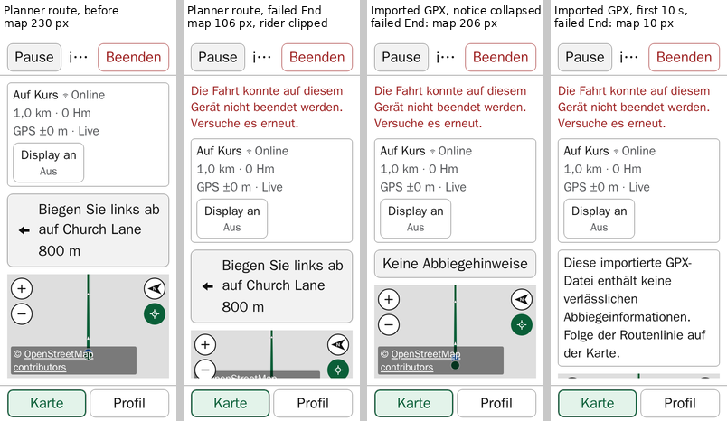
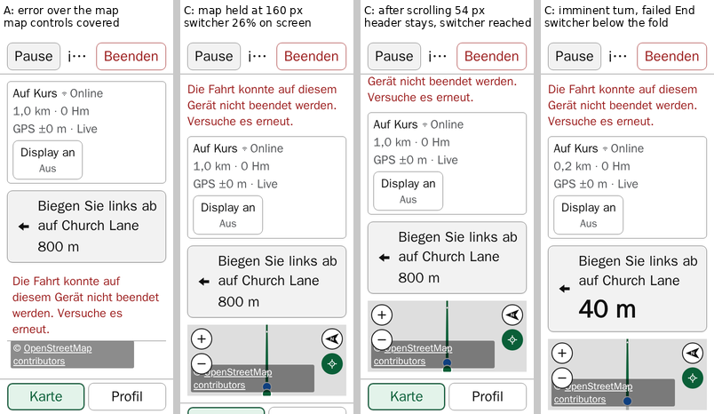

# Item 145 — Route riding's map space at enlarged text: investigation and proposal

**Status (8 October 2026): investigation complete; the proposal awaits the rider's review. Nothing is implemented, and nothing is approved.** This is [item 145](../../project/backlog.md#item-145)'s bounded investigation.

- **The baseline:** commit `cdc0529`. Its application files are identical to `677a03e`, the build accepted on the installed iPhone, so it is source-equivalent to that build. It is not byte-identical: it was built locally, with the build identity `dev`.
- **What did not change:** no application source, test, stylesheet, configuration, dependency or version in the repository.
- **The candidates** below are disposable scratch builds, kept outside the repository.

**The question.** [Item 139](../../project/history/items-132-147.md#item-139) puts a failed End ride's error on its own row below the riding header. Measured in item 139's diagnostic, at 200% browser root text, route riding's visible map then fell from 174 to 86 px in English and from 134 to 10 px in German. Item 145 asks how the error's readability, the map that remains useful and the recovery controls can be served together.

**Findings in brief:**

1. **Item 139's figures are the worst, transient case.** They were measured during the first ten seconds of an imported GPX, while its no-turn-cues notice still shows its full sentence. Once that notice collapses, the same failure leaves 242 px (English) and 206 px (German).
2. **The case that matters is a Planning route with turn cues.** Its manoeuvre card takes 162–194 px at 200%. A failed End then leaves 74–142 px.
3. **Below about 150 px the rider's position is clipped off the map.** The map container keeps a 160 px floor and the visible region clips it, so the rider is cut off and the required attribution and two map controls are partly or wholly cut off with it. In German this happens in every Planning-route case.
4. **The error alone does not explain the small map.** At 200%, before any failure:
   - the status card takes 230 px, 96 of them a wrapped **Screen on** toggle;
   - the header and the Map/Profile switcher take 79 px each;
   - each row adds a 16 px gap.
5. **A separate, pre-existing conflict exists at 200%.** The attribution wraps to a 278×62 px box. Whenever the map is shorter than about 280 px, it lies over the rider's position, which the camera holds 60 px below the map's centre. That covers every Planning-route state at 200%, failure or not. The rider's dot remains visible there, dimmed under the attribution's translucent backing.
6. **None of this occurs at ordinary text, or in the 125–175% cases swept** (free roam and a Planning route with its turn far ahead). There every failed-End state kept at least 200 px of map, with the rider, the attribution and every control visible.

**Recommendation:** candidate **C**. It keeps the visible map at the map's own existing 160 px floor, and lets the riding column scroll when it cannot fit. It measured identical to today at ordinary text, cannot engage in the 125–175% cases swept, and keeps item 139's accepted presentation exactly. Its cost is that during a failure at 200% the Map/Profile switcher is partly or wholly below the screen's edge until the rider scrolls. It does not resolve finding 5, which needs its own decision. See [Recommendation](#recommendation) and [Decisions for the rider](#decisions-for-the-rider).

These are automated browser measurements, never installed-iPhone evidence (see [Three kinds of evidence](#three-kinds-of-evidence)).

## Contents

- [Baseline and method](#baseline-and-method)
- [Three kinds of evidence](#three-kinds-of-evidence)
- [Findings](#findings)
- [Candidates](#candidates)
- [Recommendation](#recommendation)
- [Decisions for the rider](#decisions-for-the-rider)
- [Coordination](#coordination)
- [Limitations](#limitations)
- [Reproducing](#reproducing)

## Baseline and method

**The build.** `cdc05291b930145d12bd0a2fc3612bd431585aca` was exported with `git archive`, never as a worktree, and built locally (`index-Df45j2uq.js`, `0.4.69`).

**The runner:**

- the CI image by digest, `mcr.microsoft.com/playwright:v1.61.1-noble@sha256:5b8f294a…`;
- 2 workers, as each CI shard uses;
- 390×844 portrait, in Chromium (Desktop Chrome) and WebKit (Desktop Safari);
- each build served by a freshly started preview.

**The probe** was derived from `e2e/endRideFailureHeader.smoke.spec.ts` and kept outside the repository. It keeps that spec's mechanics:

- the imported straight 1 km GPX;
- the seeded language preference;
- the existing test-only seam `window.__acnE2eRideStateClearFailure`, which fails the first clear only. Its call counter read 1 after every failure.

**The root text size** is applied from document creation, as on a phone already set to a larger size, and read back in every case.

**Five ride variants:**

| Variant                                   | What the column holds besides the header and status card       |
| ----------------------------------------- | -------------------------------------------------------------- |
| Free roam                                 | nothing                                                        |
| Imported GPX, notice collapsed ("steady") | the **No turn cues** button, then the Map/Profile switcher     |
| Imported GPX, first ten seconds           | the notice's full sentence, then the switcher                  |
| Planning route, turn far ahead ("normal") | the manoeuvre card (800 m), then the switcher                  |
| Planning route, turn imminent             | the manoeuvre card at its largest (40–50 m), then the switcher |

**Two fixture details:**

- **The notice's phase.** The production ten-second timer is unchanged. The phase was read inside the same measurement call, both before the confirmation and after the failure. A pair that crossed the boundary would have been repeated, up to three times; none needed it.
- **The Planning route** is the imported route's stored `PlannedRoute` row, rewritten as a planner route: provider `openrouteservice`, profile `cycling-road`, `manoeuvreProvenance` `routing-provider`. That is the current trust path in `hasTrustedManoeuvres`. Its two manoeuvres are a left turn at 800 m and the finish at 1,000 m. The row was read back, and the card's instruction was checked on screen. The near state (400 m) was also measured on the way. **The imminent state is the largest presentation:** 194 px against 173 (near) and 162 (normal) at 200%, and 89, 78 and 72 px at ordinary text.

**Measured in each state**, before the confirmation opened and after the failure, after a fresh fix had let the follow camera settle:

- every row of the fixed riding column, reconciled to the shell's 844 px;
- the visible map region (`.ride-content-area--immersive`) and the map container;
- the rider's position (the follow anchor), whether its 10 px disc lies inside the visible region, and what is painted at its centre;
- the attribution's visible share;
- the four map controls, their visible share and a centre hit-test;
- the error's lines, size and contrast;
- Pause, End ride, the title, the Map/Profile buttons and the status card's control, with hit-tests and target sizes;
- page overflow, and focus (recorded only; see [item 135](../../project/backlog.md#item-135)).

**The runs:**

- a validation pass;
- the baseline matrix: five variants × English and German × 100% and 200% × two engines, 40 cases;
- a Profile-view check;
- candidate screening in Chromium;
- the full matrix for the viable candidates;
- a 125/150/175% sweep, run because candidate B has a size threshold.

Every run is in the evidence folder (see [Reproducing](#reproducing)).

**Chromium and WebKit agreed** to within 0.02 px on every region height, with identical line counts and rider visibility, so tables below give one value.

## Three kinds of evidence

- **Browser root-text scaling is not iOS Larger Text.** [`current-status.md`](../../project/current-status.md) records that ACN has no Dynamic Type opt-in, so the system setting does not resize the installed PWA at all. The 200% browser measurements are the project's enlarged-text evidence, not a configuration known to occur on the rider's phone.
- **The failure is synthetic.** A clear of the stored session cannot be made to fail through the installed PWA's interface, and how often one fails on a phone is unknown.
- **Nothing here is from a device.** Every figure is desktop Chromium or WebKit in the CI image, with its fonts, at one viewport. VoiceOver, physical Android, dark mode, landscape and other phone sizes were not covered.

## Findings

### 1. Item 139's figures are the notice's first ten seconds

The validation pass reproduced item 139's figures exactly: 174 → 86 px in English and 134 → 10 px in German. Both measurements fell inside the imported GPX notice's sentence phase. That sentence takes 218 px in English and 258 px in German at 200%. After ten seconds it collapses to a 62 px button. Item 139's diagnostic made both readings within those seconds.

A first probe changed the text size mid-ride instead. Its follow camera did not settle, and its post-failure reading fell after the collapse: 242 and 206 px. That is a probe artefact, recorded here because it shows how sharply the figures depend on the phase.

### 2. What the column spends

**At 200% root text.** Each row is followed by a 16 px gap. Route riding's switcher is 79 px in every route row, and the error row costs its height plus one more gap.

| Variant                  | Header | Status card | Notice or manoeuvre card | Map before | Error row | Map after the failure |
| ------------------------ | -----: | ----------: | -----------------------: | ---------: | --------: | --------------------: |
| Free roam                |     79 |         190 |                        — |        543 |  72 / 108 |             455 / 419 |
| GPX, notice collapsed    |     79 |         230 |                       62 |        330 |  72 / 108 |             242 / 206 |
| GPX, first ten seconds   |     79 |         230 |                218 / 258 |  174 / 134 |  72 / 108 |               86 / 10 |
| Planning route, normal   |     79 |         230 |                      162 |        230 |  72 / 108 |             142 / 106 |
| Planning route, imminent |     79 |         230 |                      194 |        198 |  72 / 108 |              110 / 74 |

Pairs are English / German. The Planning route's instruction wraps to two lines in both languages.

**At ordinary text** the map stays large:

| Variant                  | Map before → after the failure (English / German) |
| ------------------------ | ------------------------------------------------- |
| Free roam                | 678 → 644 / 626                                   |
| GPX, notice collapsed    | 530 → 496 / 478                                   |
| GPX, first ten seconds   | 518 → 484 (English); 499 → 447 (German)           |
| Planning route, normal   | 502 → 468 / 450                                   |
| Planning route, imminent | 485 → 451 / 433                                   |

The error row is 18 px in English and 36 px in German.

**The status card at 200%.** Route riding's card is 230 px. It is 40 px more than free roam's, for the remaining-distance line. Its **Screen on** / **Display an** toggle has wrapped beneath the status text onto a row of its own: an 88 px button plus an 8 px gap. At ordinary text the toggle sits beside the text, and the card is 80 px.

### 3. The error itself

The error's presentation measured well in every case, both engines included:

- the whole sentence on screen, on 1–2 lines in English and 2–3 in German;
- 27.2 px text at 200% (0.85 rem), in `rgb(155, 28, 28)` on white, a contrast of 8.15:1;
- Pause, End ride and the title unmoved;
- focus on End ride.

**Item 139's accepted presentation therefore holds.** The cost of the error is the map height it takes.

### 4. What remains usable in the map after a failure

At ordinary text, every variant keeps the rider, the whole attribution and all four map controls inside the map, in both languages. At 200%:

| Variant                  | Rider's position                             | Attribution visible | Map controls not wholly visible and tappable                            |
| ------------------------ | -------------------------------------------- | ------------------: | ----------------------------------------------------------------------- |
| Free roam                | inside                                       |                100% | none                                                                    |
| GPX, notice collapsed    | inside, under the attribution                |                100% | none                                                                    |
| GPX, first ten seconds   | clipped off (English, German)                |             0% / 0% | Zoom out, Follow, 46% and untappable (English); all four, ≤ 4% (German) |
| Planning route, normal   | half clipped (English); clipped off (German) |           84% / 26% | none (English); Zoom out and Follow 88% visible (German)                |
| Planning route, imminent | clipped off (English, German)                |            33% / 0% | Zoom out and Follow 96% (English), 21% and untappable (German)          |

**Why the rider is clipped.** The map container has a defensive `min-height: 160px` (`src/index.css`). The visible region clips it whenever the region is shorter. The camera holds the rider at H/2 + 60 px of the container, which is 140 px in a 160 px container. So once the visible region is under about 150 px, the rider's disc is cut off. The attribution, at the container's bottom, goes first.

This floor-and-clip behaviour is pre-existing. **Before any failure**, in German's first ten seconds (a 134 px region), it already puts the rider's centre 6 px below the visible edge and clips 29% of the attribution.

### 5. A pre-existing conflict: the attribution over the rider at 200%

At 200% the attribution wraps to a 278×62 px box, 8 px from the map's bottom-left. Its translucent black backing (45%) and white text lie over the rider's position whenever the map is shorter than about 280 px. That figure is derived from:

- the box's height and inset;
- the camera's 60 px offset below centre;
- the 10 px disc.

It is consistent with every measured map between 198 and 330 px. Painted pixels at the rider's centre confirm it: a dimmed blue, `rgb(14, 63, 127)`, where an uncovered dot reads `rgb(26, 115, 232)`.

**This holds before any failure in every Planning-route state at 200%**, at 230 px for normal and 198 px for imminent. It also holds after the failure for the collapsed GPX notice. It does not occur at ordinary text, where the attribution is 162×19 px.

It is independent of item 145's error. Item 115 already recorded that the attribution wraps at 200% and must stay legible and compliant.

### 6. Recovery controls

- **Pause and End ride** are 62 px at 200% (44 px at ordinary text), unmoved by the failure and tappable in every case.
- **The status card's Screen on toggle** is 88 px at 200% (62 px at ordinary text) and tappable.
- **The Map/Profile buttons** are 62 px at 200% (48 px at ordinary text). In the baseline they are always on screen and tappable, because the map absorbs every loss.
- **The title** does not move. At 200% it collapses to 64–73 px with an ellipsis: "i…" for the test route in German. That is pre-existing, and outside this item.

**The Profile view after a failure.** At 200% its pane is 206–320 px in the collapsed-notice and Planning-route cases. The 96 px elevation chart was at least 90 px visible in each.

### 7. Below 200%

The sweep (Chromium; free roam and the Planning route, normal; English and German; 125, 150 and 175%) found no rider, attribution or control loss. Every failed-End state kept at least 200 px of map. The imminent turn and the imported GPX were not swept. The status card's toggle wraps beneath the text at some point between 150% and 200%, depending on the language and the mode. Where it wraps, the card grows by 84–108 px:

- Planning route, English: 110 → 210 px between 150% and 175%;
- German: 122 → 230 px between 175% and 200%;
- free roam, German: 90 → 174 px between 150% and 175%.

## Candidates

Three families were screened at 200%, in English and German, in Chromium. The viable one was then run in the full two-engine matrix. Every candidate leaves the error's wording, its single alert, focus, the confirmation, session identity and the retry unchanged. Before and after the failure:

### A — the error laid over the map's top edge

The failed-End row moves into the map region, as an opaque bar across its top. The map keeps its allocated height, and the column does not change.

- **Rider and attribution:** visible in every case, since the map keeps its full height. In the first ten seconds in German the rider is half covered by the attribution.
- **The map left unobscured** is the allocated height minus the bar. That is effectively the baseline's in-flow figure: 141 and 69 px for the Planning route in English and German, 109 and 37 px at the imminent turn, and **0 px** in German's first ten seconds.
- **Map controls:** the bar covers all four at 200%, and **Zoom in** and **North-up** at ordinary text, in every variant. A narrower box also takes German's sentence to four lines at 200%.
- **Accepted behaviour changed:** item 139's row below the header.

**Not viable:** it hides the controls a rider needs to recover the view.

### B — the Screen on toggle on one line at enlarged text

A container query on the status card (`max-width: 16rem`, which engaged between 125% and 150% in the sweep) gives the wake-lock control its own full row, with its label and state side by side.

- **At 200%** it saves 34 px everywhere, failure or not: the card goes 230 → 196 px and 190 → 156 px.
- **On its own** that is not enough. German Planning routes still clip the rider after a failure (140 and 108 px maps).
- **At 150–175% it is a regression.** Where the toggle still fits beside the text, B forces it onto a row of its own, and the card grows:
  - free roam: 90 → 132 px;
  - Planning route: 110 → 164 px (150%) and 122 → 180 px (German, 175%).

  The toggle's wrap point depends on language and content, so no single size threshold can track it.

- **Accepted behaviour changed:** item 82's toggle presentation, at enlarged text.

**Not recommended as built.** Compacting the status card at enlarged text by content, not by threshold, is an input for [item 103](../../project/backlog.md#item-103)'s audit.

### C — the visible map kept at its own floor; the column scrolls instead

Two rules:

- the map region takes `min-height: 160px`, the map container's existing floor;
- the fixed riding shell becomes `overflow-y: auto` instead of `overflow: hidden`.

When the column cannot fit, it scrolls. The sticky header stays at the top: it measured at y = 0 after scrolling, in every case.

| Variant at 200%, after the failure | Map    |   Scroll | Rider, attribution, map controls                                                                                                                              | Switcher on screen before scrolling |
| ---------------------------------- | ------ | -------: | ------------------------------------------------------------------------------------------------------------------------------------------------------------- | ----------------------------------: |
| Free roam; GPX notice collapsed    | as now |        0 | as now                                                                                                                                                        |     100% (no switcher in free roam) |
| Planning route, normal             | 160 px |  18 / 54 | inside; attribution 100%; all controls tappable                                                                                                               |                           84% / 26% |
| Planning route, imminent           | 160 px |  50 / 86 | inside; attribution 100%; all controls tappable                                                                                                               |                            32% / 0% |
| GPX, first ten seconds             | 160 px | 74 / 150 | English: as for the Planning route. German: map partly below the edge; rider, 76% of the attribution and 15% of Zoom out and Follow off screen until scrolled |                             0% / 0% |

After scrolling to the column's end, every case had the switcher fully on screen and tappable, the rider inside the map, and the header in place.

- **At ordinary text** every figure matched the baseline, in both engines, and the shell did not scroll. **At 125–175%** C was not run: in the cases swept the region never fell below 200 px, so neither of its rules could engage.
- **Item 139's presentation is unchanged:** the error stays a full, in-flow row below the header, with Pause, End ride and the title unmoved.
- **Accepted behaviour changed:** items 56 and 58's fixed, non-scrolling riding shell now scrolls in these states. Before any failure that happens only in German's first ten seconds of an imported GPX, by 26 px.
- **Not resolved:** finding 5. At 160 px the rider still sits under the translucent attribution, dimmed but visible.

**B + C** were also run together, to measure the combination. B's 34 px reduced C's scroll: to 0 for the English Planning route, and 20 px for German. The combination carries B's regression at 150–175%.

### Not prototyped

- **Shorter wording.** It is a copy change in both catalogues, and German would still need two lines at 200%.
- **Hiding the status card's rows while the error shows.** It hides content a rider relies on.
- **Placing the map's bottom edge by the visible region instead of the 160 px floor.** With the camera's 60 px offset, a map under 140 px still cannot show the rider.

## Recommendation

**C, with the map region's floor at the map's own existing 160 px**, if item 145 is to be remedied now.

**What it achieves:**

- It is the smallest measured change that keeps, in both engines, after a failure at 200%:
  - the rider's position inside the visible map;
  - the whole attribution;
  - all four map controls visible and tappable.
- That holds in every Planning-route and collapsed-notice case.
- It keeps item 139's accepted presentation exactly.
- It measured identical to today at ordinary text, and cannot engage in the 125–175% cases swept.

**What it costs:**

- In the rare state of a failed End at 200%, the fixed column scrolls, and the Map/Profile switcher is 0–84% on screen until the rider scrolls.
- In German's transient first ten seconds of an imported GPX, part of the map is also below the edge until scrolled.
- How a page scroll and map gestures interact on a phone was not measured. That would be the first check of any implementation, with items 21, 23 and 34's MapLibre gesture method at the map's real heights.

**Keeping the current behaviour is also defensible.**

- The failure is synthetic and of unknown frequency.
- The enlarged-text condition is not one the installed iPhone PWA reaches through iOS Larger Text.
- The loss appears only at about 200%.

The rider's decision below covers it.

**Finding 5 should be decided separately, not folded into item 145's remedy.** It affects every Planning-route state at 200%, failure or not, and no floor that keeps the switcher in view can clear it: clearing the attribution needs a map of about 280 px. Directions worth measuring, none prototyped or approved, all coordinated with item 115's legibility and compliance constraint:

- a smaller follow offset in short maps;
- another place for the attribution;
- a compact attribution that stays compliant.

## Decisions for the rider

1. **Item 145's remedy.** One of:
   - implement C;
   - keep the current behaviour and close item 145 with these findings recorded;
   - something else.
2. **If C: the floor.** Confirm 160 px, the map container's existing floor and the smallest value that removes the clipping. On the measured layout, each pixel of a higher floor adds one pixel of scroll in these states.
3. **If C: the switcher.** Accept that the Map/Profile switcher may be below the screen's edge during a failed End at 200% until the rider scrolls. Otherwise a different design is needed, and none was prototyped.
4. **Finding 5.** One of:
   - file it as its own investigation;
   - widen item 145's implementation to include it;
   - leave it recorded.

   No remedy is proposed or approved here.

5. **The status card's wrapped Screen on toggle at enlarged text** (96 px at 200%). Pass it to item 103's audit as an input, given that B's size threshold measured as a regression.

## Coordination

- **[Item 139](../../project/history/items-132-147.md#item-139):** its presentation is the starting point and is preserved by C.
- **[Item 135](../../project/backlog.md#item-135):** focus after a failure stays a plain `focus()` on End ride. This investigation only recorded it. A scrolling column (C) adds a question for item 135: whether that focus, or a later one, scrolls the column.
- **[Item 103](../../project/backlog.md#item-103):** error and control styling; the status card's enlarged-text toggle. Any approved Ride-layout change from this item is reviewed before the affected parts of item 103 are refined.
- **[Item 142](../../project/backlog.md#item-142):** the paused-route screen. This investigation measured only the active riding column.
- **Items [114](../../project/history/items-114-117.md#item-114) and [115](../../project/history/items-114-117.md#item-115):** the enlarged-text precedents — Planning's in-flow layout, and the riding climb cue's height-gated placement with the attribution kept legible.

## Limitations

- **Not covered:**
  - phone sizes other than 390×844;
  - landscape;
  - dark mode;
  - VoiceOver;
  - physical Android;
  - any installed-iPhone condition.
- **Not measured:**
  - a failed Pause shown together with a failed End;
  - a recognised climb's cue over the map;
  - the off-route, stale-fix and offline states, which can change the status card's height.
- **The test route** is a straight 1 km line with a flat elevation. The rider sat 5–15 m from its start in some cases, where the route's start marker is painted over the rider's dot. The paint checks therefore used the imminent-turn cases, 750 m along.
- **Not modelled:** a real ORS instruction's length and wording.
- **The 280 px threshold in finding 5** is derived from measured sizes and is consistent with the maps measured, but was not swept continuously.
- **No phone result:** how a scrolling riding column behaves under touch, momentum or iOS overscroll was not measured.

## Reproducing

The evidence folder is outside the repository and never committed: `~/acn-review/item-145/`.

- **`run.sh`:** the CI image by digest, at 2 workers. It refuses to reuse an output directory.
- **`probe/`:** the probe and its configuration.
- **`trees/`:** the baseline and candidate exports, each candidate's `.diff`, and the build logs.
- **`out/`:** every run, including the two that ran nothing because of a runner mistake. Each holds per-case JSON records, screenshots and Playwright's output.
- **`scripts/`:** the summaries and the composites.
- **`notes.md`:** the run log, with bundle names and markers.

The figures above can be regenerated from the JSON records.
