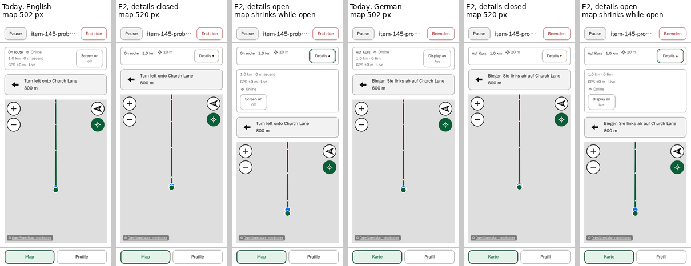
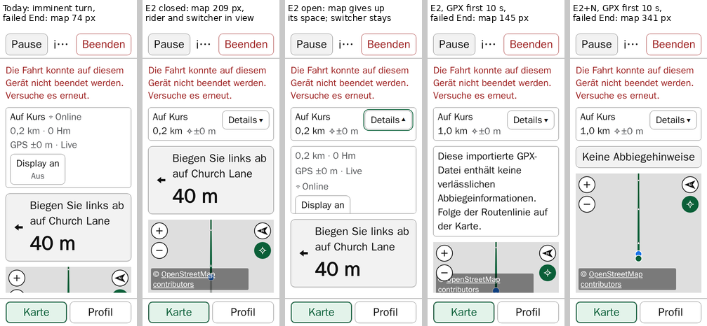
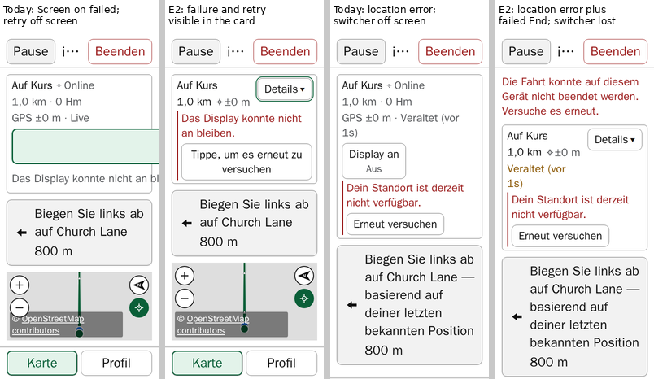

# Item 145 — Riding information priorities: a compact summary with expandable details

**Status (9 October 2026): investigation complete. The proposal awaits the rider's review; nothing is implemented, and nothing is approved.**

This is [item 145](../../project/backlog.md#item-145)'s second bounded investigation, following the rider's revised direction of 9 October 2026. The 8 October investigation, its candidates A, B and C, and its findings remain [the first report](README.md), unchanged.

- **The baseline:** `681133f`. Its application files are identical to `cdc0529` and `677a03e`, the build accepted on the installed iPhone; only the workflow differs. It is source-equivalent to that build, never byte-identical.
- **Reused:** the 8 October baseline build and its measurements.
- **What did not change:** no application source, test, stylesheet, configuration, dependency or version in the repository. The prototypes here are disposable scratch builds, kept outside it.

## The revised constraints (the rider, 9 October 2026)

- **Active riding should need as little scrolling as possible.**
- **The Map/Profile switcher must stay on screen**, and must not move behind a disclosure.
- **Candidate C is not approved.** Its scrolling riding shell must not be implemented.
- **This information-priority investigation replaces the proposed padding-only "D" experiment.**
- **The order stays 145 → 142 → 103 → 120.** Nothing is approved for implementation, and items 142, 103 and 120 are not started.
- **Item 139's readable failed-End row is preserved** in the preferred prototype. Any change to it would have to be identified for the rider's decision; none is proposed.
- **The attribution overlap stays a separate finding** ([first report, finding 5](README.md#5-a-pre-existing-conflict-the-attribution-over-the-rider-at-200)). No attribution remedy is included here.

## Summary

**The proposal is E2, a compact status summary with a Details button.**

- **Always visible:**
  - the on-route status;
  - the remaining distance;
  - a compact GPS accuracy, `⌖ ±8 m`.
- **Visible while relevant:** a stale fix's age, Offline, and an active Screen on lock.
- **In the card while active, never behind the disclosure:** every failure and its recovery action.
- **Moved behind Details:**
  - the remaining ascent;
  - the "Live" freshness word;
  - the visible "Online" word;
  - the Screen on control itself.

The next turn, the GPX notice, the failed-End row, Pause, End ride and the Map/Profile switcher are unchanged.

**The measured benefit, closed.** These are the visible map after a failed End, today → E2. Chromium and WebKit agreed to within 0.02 px.

| Case                            | 200% root text, English / German | Ordinary text, English / German |
| ------------------------------- | -------------------------------- | ------------------------------- |
| Free roam                       | 455 / 419 → 551 / 515            | 644 / 626 → 655 / 637           |
| Imported GPX, notice collapsed  | 242 / 206 → 377 / 341            | 496 / 478 → 514 / 496           |
| Imported GPX, first ten seconds | 86 / 10 → 221 / 145              | 484 / 447 → 502 / 465           |
| Planning route, turn far ahead  | 142 / 106 → 277 / 241            | 468 / 450 → 486 / 468           |
| Planning route, turn imminent   | 110 / 74 → 245 / 209             | 451 / 433 → 469 / 451           |

- **The card:** at 200% it shrinks from 230 px (route riding) and 190 px (free roam) to 94–95 px. At ordinary text it goes from 80 and 73 px to 62 px.
- **At 200%, closed, after a failed End with no other failure,** every case keeps the rider's position, the whole attribution, all four map controls and the switcher. The exception is German's first ten seconds of an imported GPX: 145 px, the rider half clipped.
- **With a second failure, German at 200%:**
  - a refused Screen on request leaves 67 px of map (today 44 px);
  - an imagery error leaves 39 px (today 0 px);
  - a location error with a frozen instruction is covered under Not resolved below.

**What it costs:**

- **What a glance loses** is listed in [the priorities](#proposed-information-priorities).
- **Opening the details takes map space.** At 175–200% on a Planning route it can take all of it while open. The switcher always stays.
- **E2 applies at every text size**, so it changes everyday riding at ordinary text too, for only 11–18 px of map.

**Optional: E2+N**, the GPX notice compact from the start. It changes item 97's first ten seconds and its announcement, and takes German's case to 341 px.

**Not resolved:**

- **Location error with a frozen instruction.** On a Planning route in German at 200%, a location error makes the frozen turn instruction 294 px tall. A failed End on top of that pushes the switcher off screen with E2 too. Today it is off screen before any End fails.
- **The attribution over the rider** at 200% (finding 5) is unchanged.

**Found on the way, and repaired by E2's layout:** today, in German at 200%, a failed Screen on request clips its message and **Tap to try again** off the card's right edge. That control is then 0% visible and untappable.

All of this is automated browser evidence. Browser root-text scaling is not iOS Larger Text, which does not resize the installed PWA at all. The End failure is synthetic. VoiceOver is not established.

## Contents

- [Method](#method)
- [Inventory](#inventory)
- [Proposed information priorities](#proposed-information-priorities)
- [The prototype](#the-prototype)
- [Screening, and what it changed](#screening-and-what-it-changed)
- [Measurements](#measurements)
- [Accessibility: what the evidence does and does not show](#accessibility-what-the-evidence-does-and-does-not-show)
- [Changes to accepted behaviour](#changes-to-accepted-behaviour)
- [Recommendation](#recommendation)
- [Decisions for the rider](#decisions-for-the-rider)
- [Limitations](#limitations)
- [Reproducing](#reproducing)

## Method

**The probe.** It is the 8 October probe, extended and kept outside the repository. Its validity checks are unchanged:

- the root text size, applied from document creation and read back;
- the synthetic End failure's seam count of 1;
- the imported GPX notice's phase, read in the same call before the confirmation and after the failure, with a pair repeated if the ten-second boundary fell between them. No pair needed repeating.

**The trusted fixture.** The imported route's stored `PlannedRoute` row is rewritten as a planner route with `manoeuvreProvenance: routing-provider`, the current trust path in `hasTrustedManoeuvres`. It is read back, and the instruction is checked on screen. The imminent state (50 m before the turn) is the largest manoeuvre presentation measured (8 October).

**The runner and viewport.** The CI image runs by digest, at 2 workers, at 390×844 portrait, in Chromium (Desktop Chrome) and WebKit (Desktop Safari).

**Added for this slice:**

- **Details, closed and open.** After the failed End, the probe opens Details from the keyboard (Enter on the focused button) and measures; closes and measures; opens again; takes a fresh fix and measures; then scrolls the details panel to its end and measures. A separate run opens Details during an ordinary ride, with no failure on screen.
- **Lifecycle counters,** using init-script stubs on the patterns of `ridingWakeLock.spec.ts` and `coldStartPausedRoute.smoke.spec.ts`:
  - `watchPosition` and `clearWatch` calls;
  - wake-lock `request` and `release` calls;
  - the stored ride row, read before a Details toggle pair and after it, with no fix in between.
- **Representative states,** baseline and E2:
  - a location error: synthetic, through the stubbed watch's own error callback, `POSITION_UNAVAILABLE`;
  - offline: `setOffline`;
  - an imagery load error: the map style request fails;
  - Screen on held;
  - Screen on refused: the stubbed request rejects;
  - **a fresh but inaccurate fix:** ±80 m on the route line. That is not stale, and not off route.
- **Clipping,** measured against the card's own box and the viewport for everything in the summary and the failure rows, and against the details panel's box and the viewport for the details' content and controls.
- **The "usable map"** is judged as before: the visible region (never the container's height), the rider's 10 px disc inside it and painted, the attribution's visible share, the four map controls' visible share and centre hit, and the switcher wholly on screen and tappable.

## Inventory

**Route riding, active, top to bottom.** "200%" figures are German / English at 200% root text, with ordinary text in brackets, from the 8 October and 9 October baselines. Each row also costs a 16 px gap.

| Element                                        | Appears when                               | Supports                              | Kind                                                                             | Elsewhere                                                                | Semantics today                                                                                          | Space                                                                                                       | Accepted behaviour a change would revise                     |
| ---------------------------------------------- | ------------------------------------------ | ------------------------------------- | -------------------------------------------------------------------------------- | ------------------------------------------------------------------------ | -------------------------------------------------------------------------------------------------------- | ----------------------------------------------------------------------------------------------------------- | ------------------------------------------------------------ |
| Header: Pause, title, End ride                 | Always while active                        | Pausing; ending; which route          | Normal                                                                           | Title also pre-ride                                                      | Buttons; the title is the `h1`, truncated by CSS; End's name is "End ride" / "Fahrt beenden"             | 79 (61)                                                                                                     | Items 55, 68, 76; 113 (`0.4.42`, `0.4.43`); 134; 139         |
| Failed-End row                                 | After a failed End, until the next attempt | Knowing to retry                      | Failure                                                                          | —                                                                        | `role="alert"`; focus returns to End ride                                                                | 108 / 72 (36 / 18)                                                                                          | Item 139 (the row has automated evidence only)               |
| Failed-Pause row                               | After a failed Pause                       | Knowing to retry                      | Failure                                                                          | —                                                                        | `role="alert"`; focus returns to Pause                                                                   | Not measured                                                                                                | Item 139's precedent                                         |
| End confirmation row                           | While confirming                           | Confirming or cancelling              | Normal                                                                           | —                                                                        | Non-modal `role="dialog"`; Cancel focused; Escape cancels                                                | Not measured                                                                                                | Items 113 (`0.4.43`), 119                                    |
| Status label                                   | Always                                     | **Am I on the route?**                | Normal; limitation (possibly off route; waiting); failure (off route; GPS error) | Frozen qualifier on the manoeuvre; stale elevation marker                | `role="status"`, or `role="alert"` when off route; the same element throughout, so changes are announced | 1 line                                                                                                      | Items 75, 104; CLAUDE.md priority 2                          |
| Connectivity                                   | Always                                     | Whether map imagery can load          | Normal (online); limitation (offline)                                            | Status screen                                                            | `role="status"`, always mounted; icon `aria-hidden`                                                      | Inline with the label                                                                                       | Item 83                                                      |
| Remaining distance · ascent                    | With a fix and a known distance            | How far and how much climbing is left | Normal                                                                           | Whole-route totals pre-ride; a climb's remaining distance in Profile     | No role; a spelled-out `aria-label`; not announced                                                       | 1 line                                                                                                      | Item 69; CLAUDE.md line 170 (distance)                       |
| GPS line: `GPS ±N m · Live` or `· Stale (age)` | With a fix                                 | Whether to trust the position         | Normal (live); limitation (stale; inaccurate)                                    | Status screen (the stored fix); stale elevation marker; frozen qualifier | Plain text; not announced                                                                                | 1–2 lines                                                                                                   | Items 69, 82; CLAUDE.md lines 170, 172                       |
| Screen on toggle                               | Wake lock supported and ride active        | Keeping the screen awake              | Normal (a setting)                                                               | Settings explanation                                                     | `aria-pressed` for the **preference**; visible On/Off is `aria-hidden`                                   | Its own 88 px row + 8 at 200% (wrapped); beside the text at ordinary text                                   | Milestone 4 / item 10; items 68, 82 (a non-colour state cue) |
| "Screen staying awake."                        | The lock is held                           | Confirmation                          | Normal                                                                           | —                                                                        | Visually hidden `role="status"`, mounted on activation                                                   | 0                                                                                                           | Item 68                                                      |
| Wake-lock failure + **Tap to try again**       | The request failed                         | A deliberate retry                    | Failure                                                                          | —                                                                        | `role="alert"`, inside the toggle column                                                                 | +62 at 200% German, **clipped off the card's right edge, retry unreachable**; +115 at ordinary text English | Items 10, 68, 82                                             |
| Location error + **Try again**                 | A geolocation error                        | Recovering location                   | Failure                                                                          | Status screen; frozen qualifier; stale marker                            | `role="alert"`; Try again ≥ 44 px                                                                        | +174 at 200% German; +48 at ordinary text English                                                           | Item 75; CLAUDE.md's Try again rule                          |
| Imagery row + **Retry map imagery**            | Imagery delayed or failed                  | Retrying imagery                      | Limitation or failure                                                            | MapView's own banners where unhosted                                     | `role` per kind; Retry                                                                                   | +202 at 200% German; +58 at ordinary text English                                                           | Items 108 (accepted on the bike), 115                        |
| Next turn                                      | A trusted route, Map view                  | The next manoeuvre                    | Normal; the frozen qualifier is a limitation                                     | A compact cue in Profile when near                                       | `role="status"` on the instruction only                                                                  | 162 / 173 / 194 (normal, near, imminent); **294 frozen**, German, location error (72 / 78 / 89)             | Item 8 / Milestone 4; items 47, 56                           |
| Turn information unavailable                   | An untrusted, non-GPX route                | That no turns will come               | Limitation                                                                       | —                                                                        | `role="status"`                                                                                          | Not measured                                                                                                | Item 8                                                       |
| Untrusted-GPX notice                           | An imported GPX without trusted turns      | That no turns will come               | Limitation                                                                       | —                                                                        | A ten-second `role="status"` sentence, then the **No turn cues** disclosure                              | Sentence 258 / 218 (75 / 56); button 62 (44)                                                                | Item 97                                                      |
| Completion panel                               | Route complete                             | Finish or keep riding                 | Normal                                                                           | —                                                                        | `role="status"`; buttons                                                                                 | Not measured                                                                                                | The Finish ride flow                                         |
| Map/Profile switcher                           | Route riding                               | Changing the view                     | Normal                                                                           | —                                                                        | `role="group"`; `aria-pressed` buttons                                                                   | 79 (65)                                                                                                     | Item 56 (accepted with item 113's batch 4)                   |

**Free roam.**

- **The status label** reads Location, Location — signal lost, GPS error, or Waiting.
- **The card** is 190 px at 200% (73 at ordinary text). It has no remaining line, no manoeuvre card, no GPX notice and no switcher.
- **Its location error** is +174 px at 200% German.

**Coordinated only, not redesigned.** These are overlays, so they take no height in the column:

- the zoom, North-up and Follow controls (shown only while watching);
- the attribution (278×62 px at 200%; finding 5);
- the recognised-climb cue;
- the paused-Follow toast.

**Facts from source that shaped the prototype:**

- **The wake lock lives inside the Screen on control.** `useScreenWakeLock` runs inside `RidingWakeLockControl` (`RidingWakeLockControl.tsx:51`), so the lock's lifetime is that control's mount lifetime.
  - Unmounting the control releases the lock, and Pause relies on that (`useRideNavigation.ts:572-576`).
  - Remounting it re-requests the lock even after a failure, bypassing the rule that only a deliberate retry may (`useScreenWakeLock.ts:21-24`).
  - So the control cannot simply sit in a panel that mounts only while open.
- **Everything else lives outside the card:** the location watch, fix-age ticking, the online state and the imagery state.
- **Staleness is event-driven.** No fix-age threshold exists. `MAX_TRUSTED_ACCURACY_METRES = 100` affects only off-route trust, and the card has no "unreliable" wording. A fresh fix of ±80 m is shown today only by its accuracy figure.
- **The map draws no accuracy circle.** The card's figure is the only accuracy display.

## Proposed information priorities

These are hypotheses for the rider's decision, not approved classifications. No warning that applies independently is suppressed, and no new GPS-quality threshold is introduced.

| Information or control                                           | Proposed priority                                   | In E2                                                                                                          | What a glance loses                                                 | Extra interaction                                     |
| ---------------------------------------------------------------- | --------------------------------------------------- | -------------------------------------------------------------------------------------------------------------- | ------------------------------------------------------------------- | ----------------------------------------------------- |
| Status label (on, possibly off or off route; GPS error; waiting) | Always visible                                      | Summary; the same element and roles                                                                            | Nothing                                                             | None                                                  |
| Remaining distance (route riding)                                | Always visible                                      | Summary, bold                                                                                                  | Nothing                                                             | None                                                  |
| GPS accuracy                                                     | Always visible, compact                             | Summary: `⌖ ±8 m` (crosshair icon `aria-hidden`; spoken as "GPS accuracy ±8 metres")                           | The words "GPS" and "Live"                                          | None for the figure; Details for "Live"               |
| A stale fix and its age                                          | Prominent when relevant                             | Summary, bold warning colour, only while stale: "Stale (45s ago)"                                              | Nothing. A fresh fix is now the unmarked default rather than "Live" | None                                                  |
| Offline                                                          | Prominent when relevant                             | Summary: icon + "Offline"                                                                                      | Nothing                                                             | None                                                  |
| Online                                                           | On request                                          | Details. The summary keeps the same `role="status"` element, visually hidden while online                      | The visible word "Online"                                           | Details                                               |
| Remaining ascent                                                 | On request                                          | Details: today's whole remaining line and its `aria-label`                                                     | **Remaining ascent**                                                | Details, then close it                                |
| Screen on: the setting                                           | On request                                          | Details: today's toggle, its name, `aria-pressed` and On/Off cue                                               | The visible Off state, and one-tap switching                        | **Details, toggle, close: three taps** instead of one |
| Screen on: a held lock                                           | Visible while held                                  | Summary: "Screen on" with a phone icon, shown **only while the lock is actually held** (`status === "active"`) | Nothing                                                             | None                                                  |
| Screen on: a refused request                                     | Prominent                                           | A full-width `role="alert"` row in the card with **Tap to try again**                                          | Nothing. Today it is clipped at German 200%                         | None                                                  |
| Location error + Try again                                       | Prominent                                           | Card row, unchanged                                                                                            | Nothing                                                             | None                                                  |
| Imagery row + Retry map imagery                                  | Prominent                                           | Card row, unchanged                                                                                            | Nothing                                                             | None                                                  |
| Next turn; frozen qualifier                                      | Always visible / when relevant                      | Unchanged                                                                                                      | Nothing                                                             | None                                                  |
| No turn cues (an imported GPX)                                   | Always visible, compact; its explanation on request | E2: unchanged (item 97). E2+N: compact from the start                                                          | E2+N: the first ten seconds' sentence                               | E2+N: tap No turn cues to read it                     |
| End and Pause errors                                             | Prominent                                           | Unchanged (item 139)                                                                                           | Nothing                                                             | None                                                  |
| Pause, End ride, Map/Profile                                     | Always visible                                      | Unchanged                                                                                                      | Nothing                                                             | None                                                  |

**What the Screen on indicator means:**

| Wake-lock state      | What shows                                              |
| -------------------- | ------------------------------------------------------- |
| The setting is off   | Nothing in the summary; the toggle in Details reads Off |
| Acquiring            | Nothing yet                                             |
| **The lock is held** | "Screen on" in the summary                              |
| Refused              | The failure row and **Tap to try again**                |
| The page is hidden   | Nothing (the hook releases the lock, as today)          |

The indicator therefore reports the lock, not the preference. The toggle's `aria-pressed` still reports the preference, as today.

**Everyday riding at ordinary text, independent of the enlarged-text benefit.** E2 applies at every size, so a rider at ordinary text would also notice the following.

- **One summary line,** "On route 1.0 km ⌖ ±8 m", with **Details** at its right.
- **Ascent remaining, "Live" and "Online" are no longer visible** without opening Details.
- **Screen on changes:**
  - turning it on or off takes three taps instead of one;
  - while it is off, nothing on the riding screen says so;
  - while the lock is held, "Screen on" shows in the summary.
- **The map gains 11–18 px** (card 80 → 62 px route, 73 → 62 px free roam).
- **Opening Details at ordinary text** leaves 353 px of map on a Planning route and 548 px in free roam, with the rider in view.

## The prototype

**E2 is a disposable build of `681133f`.** It changes `RidingStatusCard.tsx`, `FreeRoamStatusCard.tsx`, `RidingWakeLockControl.tsx`, the two catalogues (four new keys) and `index.css`. Nothing else, item 139's rows and item 97's notice included, is touched.

**The summary (the card's main region):**

- the status label;
- the remaining distance, with an `aria-label` for the distance alone;
- the compact accuracy;
- the stale age while stale;
- the connectivity status, visible only while offline;
- the "Screen on" indicator while a lock is held;
- **Details**, a button showing "Details ▾" in both languages. It is 44 px at ordinary text and 54 px at 200%. It carries `aria-expanded`, and `aria-controls` only while open, as item 97's **No turn cues** does. The chevron is `aria-hidden` and turns while open.

**Failure rows sit in the card below the summary, never inside the details:**

- Screen on refused;
- the location error;
- the imagery row.

**The card never scrolls.** In 788 measured E2 states, nothing in the summary or the failure rows was clipped by the card or the viewport, every button in them was tappable, and the card never overflowed.

**The details panel.** It is rendered only while open. It holds:

- the remaining line with ascent;
- the full GPS line;
- the connectivity in words;
- the Screen on toggle.

It has no role and no live region.

**Placement.** The panel is a separate row directly beneath the card in the riding column. It is the column's only row that shrinks, and it scrolls internally when it must. So opening it cannot push the switcher down; **the map gives up the space**. Where the map has none left, the panel scrolls. Its toggle was 0–100% visible before scrolling (0% in German's first ten seconds at 200%), and fully visible and tappable after, in every case. Details itself, the closing control, is in the summary and never moves.

**What opening covers, and what is unavailable while open:**

| Condition (after a failed End, unless stated) | Map while Details is open                                                            |
| --------------------------------------------- | ------------------------------------------------------------------------------------ |
| Ordinary text                                 | 284–347 px in route riding; 496–514 px in free roam                                  |
| 200%, collapsed GPX notice                    | 123 px (English) and 87 px (German)                                                  |
| 200%, Planning route; GPX first ten seconds   | 0–23 px. The map, its controls and the rider are unavailable until Details is closed |
| 200%, no failure on screen                    | 111 px on a Planning route (rider not in view); 429 px in free roam                  |
| 125–175% sweep                                | 30–256 px on a Planning route                                                        |

No alternative placement was measured. Laying the panel over the map would also cover the map while open, so it would resolve no concrete problem the in-flow panel leaves.

**The camera after a resize.** Opening or closing Details resizes the map. Until the next fix, the rider stays where it was relative to the map's top edge:

- in WebKit it sat at or just below the shortened map's edge in six ordinary-text and 200% cases;
- Chromium re-anchored sooner;
- after one fresh fix, both engines showed the rider in view.

While riding, fixes arrive about once a second. That interval is an expectation, not something measured here.

**Lifecycle.**

- **Ownership.** A `WakeLockOwner` calls `useScreenWakeLock` and is mounted under exactly today's condition (the card's `wakeLock` prop defined: supported, and not idle). It reports `status` and `retry` to the card and renders nothing. The toggle in the details is presentational.
- **The result:** collapsing the details unmounts nothing that owns a lifecycle.
- **Measured** across a Details open-and-close pair with no fix between, in every E2 case in both engines (104 full-matrix and state cases, plus the sweep and the ordinary-ride run):
  - `watchPosition`, `clearWatch`, wake-lock `request` and `release` counts unchanged;
  - the stored ride row byte-identical.
- **No silent retry.** After a **refused** request, toggling Details did not request again: the count stayed 1. After a successful one, it neither released nor requested.

**The tests an implementation would change.** These are recorded, not changed:

- unit tests pinning the card's structure: `RidingStatusCard`, `FreeRoamStatusCard`, `RidingWakeLockControl` and the screens' wake-lock blocks;
- `ridingWakeLock.spec.ts`'s column and toggle geometry;
- `ridingStatusCardRecovery.spec.ts`;
- `mapImageryRecovery.spec.ts`'s card checks;
- specs that wait for visible "GPS ±" or "X km · 0 m ascent" text.

## Screening, and what it changed

The screening ran in Chromium: German at 200%, the imminent-turn and first-ten-seconds failure cases, then English and ordinary text.

**E1, the first build.** It moved only the toggle, ascent and online state into Details, and kept today's full GPS line in the summary.

- The card fell only from 230 to 170 px. "Details" beside the text squeezed the summary into four lines.
- The imminent-turn failure left 134 px of map, with the rider out of view. The first ten seconds left 70 px.

**E1 with accuracy moved into Details (E−A), a probe-only switch.** The card fell to 94 px, leaving 210 px and 146 px.

**E2 keeps the accuracy, compactly, as `⌖ ±8 m` beside the distance.** That gave a 95 px card, 209 px and 145 px. **Keeping accuracy visible therefore costs about 1 px** against moving it into Details. Removing it would lose the only accuracy display for no measurable gain, so it is not recommended. It stays recorded as an option.

**E2+N** was then measured only for the imported-GPX cases, because E2 alone leaves German's first ten seconds at 145 px.

## Measurements

**Before any failure, at 200%** (map, today → E2):

| Case                           | Map                                               |
| ------------------------------ | ------------------------------------------------- |
| Free roam                      | 543 → 639                                         |
| Collapsed GPX notice           | 330 → 465                                         |
| First ten seconds              | 174 → 309 (English); 134 → 269 (German); E2+N 465 |
| Planning route, turn far ahead | 230 → 365                                         |
| Planning route, imminent       | 198 → 333                                         |

**Intermediate sizes** (Chromium; free roam and the Planning route, turn far ahead and imminent):

- **No wrapping regression:** E2's card was never taller than today's at any measured size, 100% to 200%.
- **Its summary wraps** at a new boundary between 125% and 150% on a Planning route (62 → 78 px), still below today's 110 px.
- **Today's toggle wraps** between 150% and 200% (110 → 210 px in English, 122 → 230 px in German). That is what B's size threshold could not follow; E2 has no such row.
- **A baseline figure not swept on 8 October:** the imminent turn at 175% in English leaves 172 px after a failure, with the rider in view.

**The representative states,** after a failed End, German at 200% then English at ordinary text, Planning route (turn far ahead). Free roam behaved alike, except where noted.

| State                       | Today: card, map before → after                            | E2: card, map before → after                          | Notes                                                                          |
| --------------------------- | ---------------------------------------------------------- | ----------------------------------------------------- | ------------------------------------------------------------------------------ |
| Offline                     | 230, 230 → 106                                             | 135, 325 → 201                                        | "Offline" visible in the summary                                               |
| Screen on held              | 230, 230 → 106                                             | 135, 325 → 201                                        | The indicator shows; counts 1 request, 0 releases, unchanged by toggles        |
| Fresh but inaccurate, ±80 m | 230, 230 → 106                                             | 134, 326 → 202                                        | The summary shows `±80 m`; neither stale nor off route                         |
| Screen on refused           | 292, 168 → 44; **retry off screen**                        | 269, 191 → 67; retry visible and tappable             | Free roam: E2's card is 16 px taller, because the failure is no longer clipped |
| Imagery load error          | 432, 28 → 0; **switcher pushed off** after the End failure | 297, 163 → 39; switcher stays                         | —                                                                              |
| Location error              | 404, 0 → 0; **switcher off screen before and after**       | 309, 19 → 0; switcher on screen before, **off after** | The frozen instruction is 294 px                                               |
| Ordinary text, every state  | card 73–195, map 353–678                                   | card 62–136, map 412–689                              | Switcher always on screen; rider in view                                       |

**The usable map at 200%, closed, after a failed End.**

- **Rider, attribution and controls:** the rider's disc was inside the map and every map control was wholly visible and tappable in every Planning-route and collapsed-notice case.
- **The attribution was 100% visible** in every one of those cases. **Its overlap of the rider remains**, as finding 5 says, whenever the map is under about 280 px. E2 makes such maps rarer, but does not remove the conflict, and no remedy is included.
- **Engine agreement:** Chromium and WebKit agreed to within 0.02 px on every region. Rider visibility differed only in the resize transient described above.

## Accessibility: what the evidence does and does not show

**Established, in Chromium and WebKit, from the DOM and browser focus:**

- the button's name is "Details", from its visible text;
- `aria-expanded` is false, then true, then false again;
- `aria-controls` is present only while open, and names the panel;
- focus stays on Details after each Enter, in both engines;
- the panel has no role and contains no live region;
- exactly one connectivity `role="status"` element exists at a time;
- the status label keeps today's element and roles;
- item 139's failed-End row is unchanged: the header never moved, every line was visible, and focus stayed on End ride, across all 104 E2 failure cases;
- every summary and failure control is at least 44 px and passes a centre hit-test.

**Not established: what VoiceOver announces.** DOM roles, live-region text changes and focus readings say nothing about speech. In particular:

- whether VoiceOver announces the stable connectivity status when it changes while visually hidden;
- whether it reads the accuracy and remaining-distance `aria-label`s. Those sit on generic `span`s, a pattern today's remaining line already uses, but which ARIA does not reliably expose. An implementation should prefer visually hidden text;
- how it presents the visually hidden "Screen staying awake." status, as today.

**Possible confusion.** The crosshair icon beside the accuracy resembles the Follow control's glyph. Whether riders read it as a button is untested.

## Changes to accepted behaviour

E2 would revise:

- **Item 75's compact card,** whose legibility check is still open on the device, and **item 82's two-column card** with its toggle beside the text. The toggle keeps item 82's name, `aria-pressed` and non-colour On/Off cue, but moves behind Details.
- **Item 83's connectivity indicator.** It is visible only while offline; the same `role="status"` element stays mounted.
- **Item 69's remaining line.** Ascent moves behind Details, and the summary keeps the distance.
- **The GPS line** (items 69 and 82). Accuracy stays visible in a compact form, and the word "Live" moves behind Details.
- **CLAUDE.md line 170** lists GPS accuracy and remaining distance among the things Riding shows. **E2 keeps both visible.** Moving accuracy behind Details (E−A) would revise that line, and is not recommended.
- **CLAUDE.md line 172**, "Always distinguish a stale fix from a fresh one and show fix age when relevant", is kept. A stale fix is labelled, with its age, in the summary.
- **E2+N only: item 97's first ten seconds.** Today an imported GPX shows its full sentence for ten seconds as a mounted `role="status"`, then collapses to **No turn cues**. With E2+N the button shows from the start, and the sentence appears only through that disclosure, with no role. So nothing is announced when the ride starts. Item 97's device acceptance covered only the compact interaction itself.

**Unchanged:**

- items 139 and 134, the header;
- item 56's switcher and the fixed, non-scrolling shell;
- item 108's imagery status in the card and item 115's row;
- the next-turn presentation;
- the map controls, the attribution and the climb cue.

## Recommendation

**E2**, the compact summary with Details, at every text size, with accuracy kept compactly in the summary. Decide **E2+N** separately.

**Why E2:**

- **At 200% it gives the map 56–135 px back** in every measured state except a refused Screen on request: 95–135 px on a Planning route and 56–96 px in free roam. There it gains 23 px on a Planning route and loses 16 px in free roam, because it now shows the failure that today is clipped.
- **After a failed End with no other failure,** the rider's position, the whole attribution, all map controls and the switcher remain in view on Planning routes and collapsed-notice GPX routes, where today the rider is clipped.
- **No failure or recovery action goes behind the disclosure,** and the card never scrolls.
- **It repairs today's unreachable Screen on retry** at enlarged text.
- **It keeps item 139 and every accepted header, switcher and next-turn behaviour.**
- **Collapsing the details changes no lifecycle.**

**Its costs, stated plainly:**

- In everyday riding, the remaining ascent and the "Live" and "Online" words leave the glance.
- Screen on takes three taps, and its Off state is no longer shown.
- Opening Details at enlarged text can take the whole map until it is closed.
- The benefit at ordinary text is small: 11–18 px.

**Not resolved by E2:**

- **German at 200%, location error, frozen instruction and a failed End together:** the switcher is still lost. Today it is lost earlier.
- **The attribution over the rider** at 200%.
- **German's first ten seconds of an imported GPX** at 145 px, unless E2+N is chosen.

## Decisions for the rider

1. **Adopt E2's priorities?** In particular:
   - ascent, "Live" and "Online" behind Details;
   - Screen on behind Details, with "Screen on" shown only while a lock is held, and nothing while off;
   - E2 at every text size.

   Alternatively, adjust any row of [the priorities table](#proposed-information-priorities).

2. **GPS accuracy.** Keep `⌖ ±N m` in the summary (recommended; it measured as costing about 1 px). Or move it behind Details: an explicit loss of the only accuracy display, revising CLAUDE.md line 170.
3. **E2+N.** Start the GPX notice compact (changing item 97's first ten seconds and their announcement), or keep item 97 and accept 145 px, rider half clipped, in German's first ten seconds if an End fails then.
4. **The open-details state.** Accept that Details takes the map's space while open at enlarged text, with the switcher kept and the rider re-centred at the next fix. Or ask for a different placement, which would need its own measurement.
5. **The remaining switcher loss** with location error, frozen instruction and failed End in German at 200%. Accept it as a rare compound state, or ask for a bounded look at the frozen qualifier's length, which drives the 294 px.
6. **Today's clipped Screen on retry** at enlarged text. It is repaired by E2. If E2 is not adopted, file it separately?
7. **Finding 5, the attribution over the rider,** remains its own decision from the first report.

## Limitations

- **Every figure is a desktop browser** (Chromium or WebKit in the CI image, with its fonts) at 390×844 portrait.
- **Root-text scaling is not iOS Larger Text,** which does not resize the installed PWA.
- **Synthetic:** the End failure, the location error and the wake-lock refusal.
- **Not observed:** an inaccurate fix that was also untrusted (worse than 100 m), or stale without an error.
- **Not measured:**
  - the Profile view with Details open;
  - a failed Pause together with a failed End;
  - the completion panel;
  - the off-route state with Details;
  - landscape;
  - dark mode;
  - other phone sizes;
  - physical Android.
- **The route is a straight 1 km line.** Real instructions may be longer than the fixture's.
- **VoiceOver is not established** (see [above](#accessibility-what-the-evidence-does-and-does-not-show)).

## Reproducing

The evidence folder is outside the repository and never committed: `~/acn-review/item-145/`.

- **`notes-9-october.md`:** this slice's run log, with bundle names and markers.
- **`trees/candE`, `candE2`, `candE2N`:** the prototype builds, with their `.diff`s.
- **`probe/probe145e.spec.ts`** and **`playwright.e.config.ts`:** the extended probe; `probe145.spec.ts` is kept unchanged.
- **`out/10-…` to `out/17-…`:** one directory per run, each with per-case JSON records and screenshots.
- **`scripts/summE.py`, `tableE.py`, `states.py`, `compose2.py`:** the summaries and the composites.
